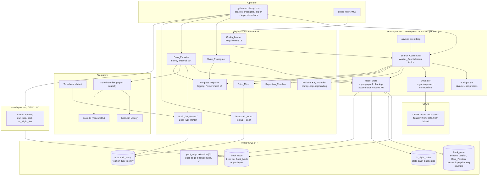
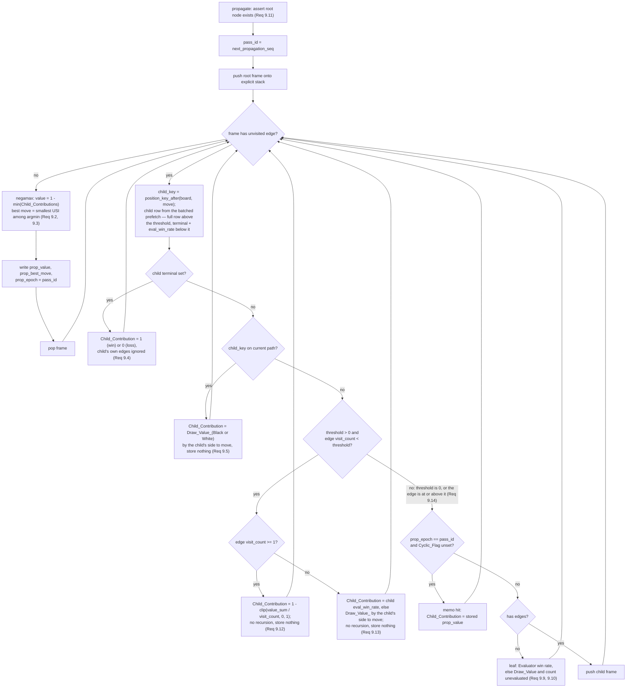
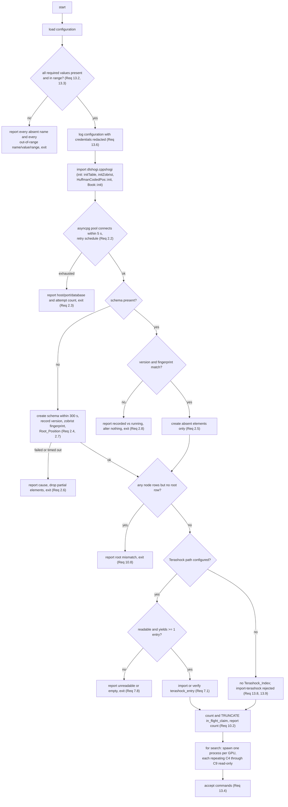

# Design Document

## Overview

PUCT Book Builder is a new Python package, `dlshogi/book/`, that grows an opening-book graph by
PUCT search over a PostgreSQL-resident graph, then propagates values by negamax and exports Apery
and YaneuraOu book files. It replaces the in-memory `MAKE_BOOK` builder in `usi/main.cpp`
(`make_book_inner` / `make_book_entry_with_uct`), whose `std::map<Key, std::vector<BookEntry>>
outMap` bounds the book by RAM and whose 64-bit `Book::bookKey` conflates positions that differ
only in the non-moving side's hand.

That propagation is **visit-aware**, because `min` selects extremes and so amplifies evaluation
error: a leaf Book_Node visited once would otherwise contribute its raw single-forward-pass
Evaluator win rate to the negamax minimum with the same authority as a subtree of a million visits,
and one over-optimistic evaluation could poison a whole line. YaneuraOu's Terashock avoids that by
running a strong search per leaf; this system's leaves are one network forward pass and are
correspondingly noisier, so a Book_Edge whose visit count is below `Propagation_Visit_Threshold`
contributes its own accumulated mean value instead of the negamax value of the subtree below it, and
the pass does not recurse past it. `Propagation_Visit_Threshold = 0` restores pure negamax; the
mechanism is in *Value propagation under a packed edge list*.

### Why the propagation pass exists at all, and what the export must carry

The offline pass is not a nicety. It moves work the engine already does under the game clock into
one full-graph pass. Confirmed by reading `cppshogi/book.cpp` and the probe call site at
`usi/main.cpp:505-509`, the engine selects one of three probe modes from the `Book_Consider_Draw`
and `Book_Consider_Draw_Depth` options declared in `cppshogi/usi.cpp`:

| mode | selected when | selects on |
| --- | --- | --- |
| `Book::probe` | `Book_Consider_Draw = false` | `count` — proportionally, or by maximum under `Best_Book_Move`. `score` enters only as a floor filter through `Min_Book_Score` |
| `Book::probeConsideringDraw` | `Book_Consider_Draw = true`, `Book_Consider_Draw_Depth = 0` | maximum `score`, with repetition results overriding the stored score |
| `Book::probeConsideringDrawDepth` | `Book_Consider_Draw = true`, `Book_Consider_Draw_Depth > 0` | maximum `score` after `Book::getMinMaxBookScore` — a recursive negamax with alpha-beta over the book file, run **at game time** under the clock and bounded by `Book_Consider_Draw_Depth` |

So two of the three modes select on `score`, and the third performs a depth-limited negamax over the
book while the engine should be searching. This system performs that negamax once, offline, over the
whole graph and to full depth. The export therefore supplies both signals from one file: `count`
carries the Book_Edge visit count (Requirement 12.1) and `score` carries the propagated value
converted through `Eval_Coef` (Requirement 12.6), so all three modes work without a second export.
That one file also holds the Book_Nodes of both sides to move (Requirement 12.12), and that is what
makes `probeConsideringDrawDepth`'s game-time negamax able to recurse at all: `getMinMaxBookScore`
descends through the opponent's replies, so a file covering only one side would return no entry at
every opponent node and the recursion would terminate at the first ply.

One thing in those functions is deliberately **not** adopted: the monotone `trusted_score` clamp
(`if (entry.score < trusted_score) trusted_score = entry.score; entry.score = trusted_score;`),
which appears in `probeConsideringDraw`, `getMinMaxBookScore`, and `probeConsideringDrawDepth` and
forces a position's move scores to be non-increasing in file order on the assumption that entries
are sorted by descending `count`. This design's scores come from a full-graph propagation rather
than from per-move searches of varying quality, and Requirement 12.3 orders records by descending
`score` rather than descending `count`, so the clamp would flatten exactly the information the pass
computes.

The design is dominated by one number. At 100,000,000 Book_Nodes and ~80 legal moves per shogi
position the graph holds ~8x10^9 logical Book_Edges. Requirement 15 criterion 3 asks for a
node-plus-all-edges read at 20 ms p95 and Requirement 15 criterion 2 asks for a sustained descent
rate; both are met only if that read is **one primary-key row read**. Requirements 1.2 and 1.3
were written to permit exactly that: Book_Edge identity is *logical*, and node-plus-edges
retrieval is *a single operation*. So the physical layout is **one row per Book_Node with the
node's whole edge list packed into a single `bytea` column**, sized to stay inline in the heap
page rather than spilling to TOAST.

Everything else follows from that choice, and the rest of this document works through the
consequences: how a 128-bit Position_Key is derived from the existing `cppshogi` Zobrist state and
how it relates to the 64-bit Apery key needed for export; how value propagation walks *forward*
from the root because a packed edge list admits no index on child Position_Key; how the
highest-frequency write in the system (visit-count and value-sum backup along every descent path)
is made HOT-friendly and free of lost updates even though an edge counter now lives inside a
shared blob; and how a 10^8-node graph is exported to a key-sorted Apery file without holding it
in RAM.

### Why Python, and not C++

An earlier revision of this design specified a standalone C++17 program, `bookbuilder/`. That
choice was wrong on four counts, and this revision reverses it.

**1. The book tooling in this repository is already Python, and one of these programs already
exists.** `dlshogi/utils/make_book_minmax.py` is a working book builder: it accumulates positions
keyed by `board.book_key()`, runs a recursive negamax with per-side draw values
(`--black_draw_value` / `--white_draw_value`), detects cycles with a `visited` set, counts
repetitions with its own `draw` counter against `board.is_draw()`, and writes
`#YANEURAOU-DB2016 1.00` output through `value_to_score(v) = -log(1/v - 1) * a`. Every one of those
mechanisms reappears in Requirements 6, 8, 9, and 12 of this document. `dlshogi/utils/book.py`
already reads and rewrites Apery `book.bin` through `np.fromfile(path, BookEntry)`, and
`dlshogi/utils/yanebook_to_book.py`, `merge_book.py`, and `delete_book_side.py` complete the
family. Writing the *large* book builder in a different language than the small one splits the
book tooling across a language boundary for no benefit.

**2. cshogi already exposes the incremental key operation this design depends on.**
`dlshogi/utils/book_to_positions.py` calls `board.book_key_after(key, move)` to obtain a child's
book key without pushing the move, inside its `exist_next` scan over every legal move — precisely
the access pattern the Node_Store needs. Confirmed against the installed cshogi 0.9.7:
`Board.book_key()` wraps `__Board::bookKey()` and `Board.book_key_after(key, move)` wraps
`__Board::bookKeyAfter(key, move)`. Measured on the development machine, `book_key_after` costs
0.14 us per call. The one gap is width, addressed in *Position_Key from Python* below.

**3. The throughput argument for C++ does not survive arithmetic.** A Selection_Descent is roughly
40 node fetches, and each fetch is a PostgreSQL round trip: about 50 us warm, up to about 1 ms
cold on a 10^8-node graph. That is 2 ms to 40 ms of I/O per descent. Against that, the per-node
Python cost is one `np.frombuffer` over the packed edge blob, a handful of vectorized numpy
operations for the PUCT score, and exactly **one** incremental child-key call — for the *selected*
edge, not one per edge, because selection picks a single child before descending. Measured on the
development machine over an 80-edge node: 15.2 us for decode plus score plus `argmax`, 0.14 us for
the child key, 0.16 us for `move16` to USI, and 2.2 us for a full event-loop turn. Call it 20 us
per node, 40 us pessimistically, so 0.8 ms to 1.6 ms of CPU per descent. Set against 2-40 ms of
I/O that is 3% to 50% overhead, not an order of magnitude, and the 50% end is the fully warm case
where Requirement 15.1's 1000 ms p95 budget has three orders of magnitude of headroom. Where
Python genuinely does cost throughput is the per-process descent rate, and *Performance budget*
below states that honestly rather than hiding it.

**4. The GIL argument was actively wrong.** The workload is thousands of concurrent descents, each
of which is a sequential chain of *dependent* database round trips — fetch a node, score its
edges, fetch the selected child, repeat. That is the canonical asyncio shape: almost all of the
wall-clock time is spent waiting on a socket, and the work between waits is small. So the
concurrency model is **asyncio tasks over asyncpg**, with `Worker_Count` concurrent descent tasks
rather than `Worker_Count` OS threads. The GIL is irrelevant to a single-threaded event loop, and
CPU parallelism, where it is needed, comes from **one OS process per GPU**.

The parts of the system that are genuinely CPU-bound and already written in C++ stay in C++ and
are reached through the existing Cython extension: move generation, Zobrist keys, feature
extraction, and network inference. The `puct_edge` PostgreSQL extension stays in C, because it
runs inside the database server.

### Reused from the existing codebase

| Existing element | File | Used for |
| --- | --- | --- |
| `Board`, `push`/`pop`, `legal_moves`, `sfen`/`set_sfen` | cshogi | Board_State along a Selection_Descent |
| `Board.is_draw()`, `Board.is_check()` | cshogi | repetition and perpetual-check classification (Requirements 8.1-8.4, 8.9) |
| `Board.is_nyugyoku()` | cshogi | WCSC declaration win (Requirement 8.6) |
| `Board.zobrist_hash()` (= `Position::getKey()`) | cshogi | path occurrence counting fallback |
| `Board.book_key()`, `Board.book_key_after()` | cshogi | Apery_Book_File key (Requirement 12.1) |
| `cshogi.move16()`, `cshogi.move_to_usi()`, `Board.move_from_move16()` | cshogi | 16-bit move storage, USI rendering |
| `cshogi.BookEntry` dtype (`<u8, <i2, <u2, <i4`, 16 bytes) | cshogi | Apery record layout, verified byte-compatible with `dlshogi/utils/book.py` |
| `cshogi.dlshogi.make_input_features`, `make_move_label`, `FEATURES1_NUM`, `FEATURES2_NUM` | cshogi | Evaluator input tensors and policy decoding |
| onnxruntime `InferenceSession` with `io_binding`, per `dlshogi/utils/usi_policy_only.py` | onnxruntime | neural network inference |
| `dlshogi/convert_model_to_onnx.py` | repo | producing the ONNX model the Evaluator loads |
| `dlshogi/cppshogi.pyx` + `cppshogi/python_module.{h,cpp}` | repo | Cython extension that hosts the new 128-bit key binding |
| `Position::getBoardKey()`, `getHandKey()`, `getKeyAndBoardKeyAfter()` | `cppshogi/position.hpp` | Position_Key and incremental child keys, via the new binding |
| `Book::bookKey()` | `cppshogi/book.cpp` | cross-check of cshogi's `book_key()` |
| `nyugyoku<false>()` | `cppshogi/search.hpp` | reference predicate for Requirement 8.6 |
| `dlshogi/utils/make_book_minmax.py` | repo | negamax and draw-value precedent, YaneuraOu output format |
| `dlshogi/utils/book.py` | repo | Apery reader used as the independent export check |
| `dlshogi/utils/spsa_usi_tuner.py` | repo | precedent for counting occurrences externally, then calling `is_draw()` at four |
| `setup.py`, `Pipfile` | build | package registration and dependency declaration |

Deliberately **not** reused: `usi/UctSearch.cpp`'s search loop and `usi/Node.h`'s `uct_node_t` /
`child_node_t`. Those are tuned for an in-RAM tree that is discarded after each `go` and carry no
notion of persistence, transposition identity, or a 128-bit key. The `MAKE_BOOK` block in
`usi/main.cpp` is superseded outright.

---

## Architecture

### Process and component structure



`propagate`, `export`, and `import-terashock` are single-process commands. Only `search` runs one
process per GPU.

### Selection_Descent flow

```mermaid
sequenceDiagram
    participant W as descent task
    participant NS as Node_Store
    participant IFS as In_Flight_Set
    participant RR as Repetition_Resolver
    participant TI as Terashock_Index
    participant EV as Evaluator

    W->>NS: await get_node(root_key)
    Note over W: Board set from Root_Position SFEN,<br/>path = [root_key], depth = 0
    loop while current node has edges and is not terminal
        W->>W: vectorized PUCT score over np.frombuffer(edges)<br/>(virtual loss from IFS, ties by ascending USI)
        W->>RR: classify(move) against path occurrence counts
        alt 4-fold repetition (Req 8.1/8.3/8.4/8.9)
            RR-->>W: draw / win / loss
            Note over W: descent value fixed, set Cyclic_Flag on path
        else non-repetition
            W->>W: child_key = position_key_after(board, move); board.push(move)
            W->>NS: await get_node(child_key)
            alt node absent
                W->>IFS: test_and_add(child_key) -- no await inside
                alt add failed (Req 11.7)
                    Note over W: exclude edge, resume at parent (Req 4.7)
                else add succeeded
                    W->>W: board.legal_moves
                    alt 0 legal moves (Req 8.5) or is_nyugyoku (Req 8.6)
                        Note over W: terminal, no edges
                    else
                        W->>EV: await enqueue(features) -- future resolved by the batch collector
                        W->>TI: await lookup(child_key)
                        W->>NS: await insert_expansion(node + packed edges) atomically
                    end
                    W->>IFS: discard(child_key) in a finally block
                    Note over W: child is the descent leaf
                end
            end
        end
    end
    W->>NS: backup(path, leaf value) -- coalesced increments
```

The whole descent runs inside `asyncio.wait_for(..., timeout=10.0)` (Requirement 15.6). Every
`In_Flight_Set` claim is released in a `finally` block, so `CancelledError` from the timeout and
from coordinator shutdown releases claims on the same path as normal completion (Requirement 11.9).

### Value propagation flow



The four-way branch after the prefetch is Requirement 9 criterion 15's precedence order, in order:
terminal, on-path revisit, below-threshold, then the child's own propagated value. The propagation
stack is bounded by `max(Max_Book_Ply, 1)` frames when `Max_Book_Ply > 0` and by a
hard guard of 1024 frames when it is 0. The stack is an explicit `list` of frame objects, not
Python recursion, which would hit `sys.setrecursionlimit` territory at depth 1024 and would make
the Cache_Budget accounting implicit. Memoization lives in the database (`prop_epoch`), so the
resident set is a frame stack plus an LRU, both inside Cache_Budget (Requirement 9.6). Details and
the reasoning behind the forward walk are in *Value propagation under a packed edge list*.

### Language and repository placement

The builder is a Python package, `dlshogi/book/`, with a `__main__.py` entry point invoked as
`python -m dlshogi.book <command>`, and `'dlshogi.book'` added to `packages` in `setup.py`
alongside the existing `'dlshogi.network'` and `'dlshogi.utils'`.

```
dlshogi/book/
  __init__.py           public names: BookConfig, NodeStore, PACKED_EDGE
  __main__.py           argparse subcommands: search / propagate / export / import-terashock
  config.py             Config_Loader, Requirement 13 validation and redaction
  keys.py               Position_Key_Function, Zobrist fingerprint, side-to-move bit
  packed_edge.py        PACKED_EDGE numpy dtype, encode / decode / patch
  node_store.py         asyncpg pool, schema management, node LRU, backup accumulator
  search.py             Search_Coordinator, descent task, In_Flight_Set, PUCT selection
  repetition.py         Repetition_Resolver, declaration-win check
  evaluator.py          asyncio batching queue over onnxruntime
  prior_mixer.py        Prior_Mixer
  book_db.py            Book_DB_Parser, Book_DB_Printer
  terashock.py          Terashock_Index, import
  propagate.py          Value_Propagator
  export.py             Book_Exporter, numpy external sort and k-way merge
  report.py             Progress_Reporter over logging
  sql/schema.sql        DDL, Requirement 2 criterion 4
  pgext/puct_edge.c     PostgreSQL C extension: in-place packed-edge patch
  pgext/Makefile        PGXS build
tests/book/
  test_*.py             pytest + hypothesis, Properties 1-48
  reference/book_db.py  independently written .db parser/printer for the cross-check
  fixtures/             golden Position_Key vectors, .db corpora, mate and entering-king positions
```

**Why a package under `dlshogi/` rather than scripts in `dlshogi/utils/`.** Every file in
`dlshogi/utils/` is a single-file script that parses `argparse` at module import time and then runs
— `book.py`, `make_book_minmax.py`, and `book_to_positions.py` all do exactly that. That pattern
cannot host this system: there are fifteen interdependent modules, the modules must be importable
without side effects so that hypothesis can generate against them, and the CLI needs four
subcommands rather than one script per verb. `dlshogi/network/` is the existing precedent for a
subpackage with no module-level side effects, and `dlshogi/book/` follows it. No thin wrapper
script is added to `dlshogi/utils/`, because it would duplicate the `__main__.py` argument surface
and the two would drift.

**Why not a new top-level directory.** A top-level `bookbuilder/` would need its own packaging,
its own path setup to import `dlshogi.cppshogi`, and its own place in `setup.py`. It depends on
`dlshogi.cppshogi` for the Position_Key binding and on `cshogi` for everything else, so it belongs
inside the package that owns that extension.

**What stays outside Python.** `dlshogi/book/pgext/puct_edge.c` is a PostgreSQL C extension built
with PGXS; it runs inside the database server process, so the host language of the client is
irrelevant to it. The 128-bit key binding is C++ inside `cppshogi/python_module.cpp`, exposed
through `dlshogi/cppshogi.pyx`, matching the existing Cython pattern exactly.

---

## Components and Interfaces

### Position_Key from Python, and the binding prerequisite

Requirement 3.1 needs at least 128 bits. cshogi's `Board.book_key()` returns Apery's
`Book::bookKey`, which is 64 bits and — confirmed in `cppshogi/book.cpp` — hashes only
`pos.hand(pos.turn())`, the *mover's* hand. It therefore fails Requirement 3.1 on width and
Requirement 3.2 on content: two Board_States differing only in the non-moving side's hand receive
equal keys. It cannot serve as the Position_Key. Neither can `Board.zobrist_hash()`, which is
`Position::getKey()` = board key plus hand key folded into 64 bits.

The values that are needed exist in `cppshogi/position.hpp` — `getBoardKey()`, `getHandKey()`, and
`getKeyAndBoardKeyAfter(Move)` — but are not exposed through the Python extension. **Adding that
exposure is a prerequisite task of this feature.** `cppshogi/position.cpp` is already compiled
into the `dlshogi.cppshogi` extension by `setup.py`, so this is an additive change to three files
and no new build target.

In `cppshogi/python_module.h`, in the style of the existing free functions:

```cpp
void __position_key_from_sfen(const std::string& sfen, char* ndkey);
void __position_keys_after(const std::string& sfen, const unsigned short* moves16,
                           const size_t len, char* ndkeys);
unsigned long long __zobrist_fingerprint();
unsigned long long __apery_book_key_from_sfen(const std::string& sfen);
```

`ndkey` and `ndkeys` are `numpy` buffers of `POSITION_KEY` dtype (below); `__position_keys_after`
sets a `Position` from the SFEN once and then calls `getKeyAndBoardKeyAfter` for each supplied
`move16`, which is the shape the propagation prefetch wants. In `dlshogi/cppshogi.pyx`, matching
the existing `cdef extern from "python_module.h" nogil:` block:

```python
cdef extern from "python_module.h" nogil:
    void __position_key_from_sfen(const string& sfen, char* ndkey)
    void __position_keys_after(const string& sfen, const unsigned short* moves16,
                               const size_t len, char* ndkeys)
    unsigned long long __zobrist_fingerprint()
    unsigned long long __apery_book_key_from_sfen(const string& sfen)

def position_key_from_sfen(str sfen, np.ndarray ndkey):
    __position_key_from_sfen(sfen.encode(locale.getpreferredencoding()), ndkey.data)
```

The key itself is a numpy structured dtype so it can live inside arrays and be written to
PostgreSQL without per-field boxing:

```python
POSITION_KEY = np.dtype([("hi", "<u8"), ("lo", "<u8")])   # itemsize == 16
```

`hi` is the Apery board key: a sum of `zobrist_[pieceType][square][color]` over occupied squares,
XOR `zobTurn_` (== 1) when White is to move. `lo` is the hand key: a sum of
`zobHand_[handPiece][color]` over both players' hand counts. Together they cover piece placement,
both hands, and side to move, and exclude ply -- exactly the Board_State definition, so
Requirement 3.2 holds by construction and Requirement 3.7's consistency invariant is a property of
`getKeyAndBoardKeyAfter` rather than of stored data.

Two facts from `cppshogi/position.cpp` that the design leans on:

- `Position::initZobrist()` fills every table entry with `g_mt64bit.random() & ~1`, and
  `g_mt64bit` is a default-constructed `std::mt19937_64` (fixed seed 5489, `cppshogi/mt64bit.cpp`).
  Keys are therefore identical across invocations, tasks, processes, and runs, satisfying
  Requirement 3.4 -- but only if nothing else draws from `g_mt64bit` before `initZobrist()`. The
  extension's existing `init()` already calls `initTable(); Position::initZobrist();
  HuffmanCodedPos::init();` at module import, and the binding addition extends it with
  `Book::init()`. `book_meta` records `zobrist_fingerprint()`. A fingerprint mismatch on a later
  start is a hard error, handled identically to the schema-version mismatch of Requirement 2
  criterion 8. Without that guard, a change to Zobrist initialisation order would silently re-key a
  267 GB graph.
- Because every table entry has bit 0 cleared and `zobTurn_ == 1`, bit 0 of a sum of table entries
  is 0 and `hi & 1` is *exactly* the side to move. Nothing filters on that bit — the export covers
  Book_Nodes of both sides to move (Requirement 12.12) — but the side to move is still needed
  wherever a value has to be oriented or a per-side constant chosen: the export's score perspective
  (Requirement 12.6) and the choice between Draw_Value_Black and Draw_Value_White (Requirements 8.2,
  9.5, 9.10, 9.13). Each of those is a `(key_hi & 1)` test with no extra column and no SFEN parsing.

**Why 128 bits and not 64.** At 10^8 distinct nodes a 64-bit key is already adequate on paper: the
expected number of colliding pairs is `n^2 / 2^65 = 10^16 / 3.69x10^19 = 2.7x10^-4`. But the
quantity that actually gets hashed and compared is not the node count, it is the number of *child
keys* the search computes and probes -- one per Book_Edge, `8x10^9` of them. At `n = 8x10^9` the
64-bit expectation is `(8x10^9)^2 / 2^65 = 1.7`, i.e. collisions are expected, and a collision
means two different Board_States silently share a Book_Node and corrupt both subtrees. At 128 bits
the same expectation is `(8x10^9)^2 / 2^129 = 9.4x10^-20`. Requirement 3.1's floor is met with a
margin that makes Requirement 3.6's collision report a defensive assertion rather than an expected
event.

**Fallback if the binding cannot be added.** Use `board.book_key()` as a 64-bit primary key, drop
`key_lo` to a constant 0, and verify identity on every read by comparing the stored `sfen` against
`board.sfen()` with the ply field stripped. The costs, in order of severity: (a) Requirement 3.1's
128-bit floor is not met, so this is a documented deviation, not a compliant implementation;
(b) Board_States differing only in the non-moving side's hand collide *by construction*, and the
SFEN check turns each such collision into a Requirement 3.6 report and a refused edge, so those
transpositions are silently unexplored rather than merged; (c) every node read must compare a
60-character string, adding roughly 1 us per node and, worse, forcing the child key to be obtained
by `board.push(move)` plus `board.book_key()` rather than by `book_key_after`, which is a full
`doMove` per candidate child rather than two Zobrist updates; (d) `key_hi & 1` no longer gives the
side to move, because `Book::ZobTurn` is a full random 64-bit value rather than 1, so every place
that needs the side to move — the export's score perspective under Requirement 12.6 and the
Draw_Value_Black / Draw_Value_White choice of Requirements 8.2, 9.5, 9.10, and 9.13 — has to read it
from a separate `turn` column or re-parse the SFEN. The binding is roughly thirty lines of C++ and
ten of Cython. It should be added.

### Node_Store

```python
PACKED_EDGE: np.dtype           # 20 bytes, defined under Data Models

@dataclass
class BookNodeView:
    key: PositionKey            # (hi, lo)
    sfen: str
    apery_key: int
    visit_count: int
    value_sum: float
    terminal: Terminal          # NONE | WIN_FOR_STM | LOSS_FOR_STM
    cyclic_flag: bool
    eval_win_rate: float | None
    prop_value: float | None
    prop_best_move16: int | None
    edges: np.ndarray           # dtype PACKED_EDGE, ascending by move USI

class GetResult(enum.Enum):
    FOUND = 1
    ABSENT = 2
    FAILED = 3

class NodeStore:
    async def get(self, key: PositionKey) -> tuple[GetResult, BookNodeView | None]: ...
    async def get_many(self, keys: Sequence[PositionKey]) -> list[BookNodeView | None]: ...
    # narrow projection for below-threshold propagation children (Req 9.12, 9.13)
    async def get_many_terminal_eval(
        self, keys: Sequence[PositionKey]
    ) -> list[tuple[Terminal, float | None] | None]: ...
    async def insert_expansion(self, w: ExpansionWrite) -> WriteResult: ...
    def backup(self, deltas: Sequence[BackupDelta]) -> None: ...     # in-memory, not a coroutine
    async def flush(self) -> None: ...
    async def set_propagation(self, w: Sequence[PropagationWrite]) -> None: ...
    def stats(self) -> Stats: ...
```

`get` consults, in order: the in-process node LRU, the pending backup accumulator (so that
uncommitted increments are visible and Requirement 4.5's visit-count invariant holds on read), and
then PostgreSQL. `ABSENT` is a distinct enum value from a `FOUND` node with `len(edges) == 0` and
from `FAILED`, and the absent path issues no INSERT, satisfying Requirement 1.4.

`backup` is deliberately *not* a coroutine: it only merges deltas into the in-process accumulator,
and making it synchronous means there is no `await` between a descent's completion and its deltas
becoming visible to `get`.

Per-edge move USI and child Position_Key are *materialised on demand*, not stored. `move_to_usi`
applied to a 16-bit move needs no board — verified empirically for normal moves, promotions, and
drops, because Apery's `proFromAndTo` encodes a drop as `from = SquareNum + pieceType` — and costs
0.16 us. The child key comes from `getKeyAndBoardKeyAfter` through the new binding, at 0.14 us per
call, and is computed for the *selected* edge only during a descent, or for all edges in one
batched call during propagation. For an 80-edge node the all-edges case is ~11 us against a ~100 us
NVMe page read, so trading 16 bytes per edge of storage for that CPU is unambiguously correct; the
storage analysis below shows those 16 bytes are exactly what decides whether a row stays inline.
Requirement 1.2's grant that Book_Edge identity is *logical* is what makes this legal.

**asyncpg, not psycopg.** The Node_Store issues one small parameterised statement per node fetch,
thousands of times per second, from an event loop. asyncpg speaks the binary protocol directly,
caches prepared statements per connection, and returns `bytea` as `bytes` with no text decoding
step, which matters because `edges` is the largest column and would otherwise pass through hex
decoding. The pool is `asyncpg.create_pool(min_size=..., max_size=...)` with `max_size` sized to
`min(Worker_Count, 64)`; beyond a few dozen connections PostgreSQL's own per-backend cost dominates
and more connections reduce throughput. Descent tasks acquire a connection for the duration of a
single statement, not for the duration of a descent, so `Worker_Count` may greatly exceed
`max_size`.

Connection handling, schema creation and versioning, and reconnection follow Requirement 2
criteria 2 through 9; see *Error Handling*.

### Search_Coordinator and descent tasks

The requirements' **Search_Worker** is realised as one asyncio task running one Selection_Descent at
a time — "descent task" throughout this document. Wherever a requirement says Search_Worker, read
descent task; the mapping is one to one, and `Worker_Count` counts tasks rather than OS threads.

One process per GPU, one event loop, `Worker_Count` concurrent descent tasks, one shared
`NodeStore` and one asyncpg pool per process (Requirement 11.1). The coordinator holds an
`asyncio.TaskGroup`-style supervisor: it keeps exactly `Worker_Count` descent tasks alive while no
stop request is pending, replacing each task as it completes (Requirement 4.13). Each task owns its
own `cshogi.Board`, its path list, and its path occurrence counter.

PUCT score, Requirement 4.2, with Requirement 11.4's virtual loss, vectorized over the decoded
edge array:

```python
edges = np.frombuffer(node.edges_blob, dtype=PACKED_EDGE)     # no copy
n     = edges["visit_count"].astype(np.float64)
w     = edges["value_sum"]
p     = edges["prior_q16"] * (1.0 / 65535.0)
vl    = virtual_loss * in_flight_mask                          # bool mask -> 0 or Virtual_Loss
n_eff = n + vl
n_par = node.visit_count + vl.sum()
q     = np.where(n_eff > 0, w / np.maximum(n_eff, 1.0), q0)     # w unchanged: virtual loss adds 0 wins
score = q + c_puct * p * (np.sqrt(n_par) / (1.0 + n_eff))
```

`w` needs no perspective flip, and that is only because a Book_Edge's accumulated value sum is stored
from the perspective of the side to move at the parent Book_Node (Requirement 4.4). So `q` is already
the parent's win rate and maximising `score` selects the move that favours the side actually choosing
it.

`q0` is 0.5 for an edge with no recorded Terashock evaluation and the Terashock-derived win rate
otherwise (Requirement 7.5), computed as a vector over the `flags` bit-0 mask. Excluded edges
(Requirement 4.7) get `-inf`.

Ties within 1e-6 resolve to the lexicographically smallest move USI. Because `edges` is stored
already sorted ascending by move USI, `np.argmax` — which returns the *first* maximal index — gives
that for free, but only for exact ties. For ties within the 1e-6 tolerance the selection is
`int(np.flatnonzero(score >= score.max() - 1e-6)[0])`, which is the first index within tolerance and
therefore the smallest USI. This is one of the two places where the numpy rewrite changes the
mechanism rather than the expression, and Property 12's generator is biased to produce
near-but-not-exact ties for exactly that reason. The virtual-loss terms are computed at scoring
time only and are never written (Requirement 11.4).

Descent termination, in evaluation order at each node:

1. `Max_Book_Ply > 0` and depth == `Max_Book_Ply` -> leaf, value from Evaluator win rate or
   terminal state, no edges created (Requirement 4.6).
2. `terminal != NONE` -> leaf, value 1 or 0 (Requirement 8.11).
3. `len(edges) == 0` -> expand (Requirement 4.3); the newly expanded node is the leaf of this
   descent. That second half is Requirement 4.11, which is stated separately because 4.3 mandates
   only the creation of the edge set and says nothing about where the descent ends.
4. otherwise select an edge, with edges whose child is in the In_Flight_Set excluded for the rest
   of this descent (Requirement 4.7); if all edges are excluded, abandon without any write and
   report (Requirement 4.9).

Nothing in that list reads the side to move. The four rules branch on depth, terminal state, edge
count, and In_Flight_Set membership; the PUCT score is computed from stored Book_Edge fields whose
perspective is already pinned to the parent Book_Node (see *Packed edge record*), so the arithmetic
never needs to know which side that parent is. Requirement 4.12 is therefore a stated property of
the search rather than a carve-out for one side: over a fixed Book_Graph, the sequence of
Position_Keys visited and the set of Book_Edges created are the same whichever side is to move at
each visited Book_Node. The descent *value* may still differ, because a repetition draw takes
Draw_Value_Black or Draw_Value_White by side to move (Requirement 8.2), but that changes what gets
backed up, not where the descent went or which Book_Edges exist. Property 16 tests exactly this.

Requirement 15.6's 10,000 ms per-descent limit is `asyncio.wait_for(self._descent(), timeout=10.0)`
around the whole descent coroutine. `wait_for` raises `CancelledError` inside the descent at its
next suspension point, and the descent's `finally` block releases In_Flight_Set claims and discards
the path without applying the backup. A deadline check at each node is kept in addition, because a
descent that is CPU-bound in a pathological numpy path would otherwise not reach a suspension point;
the check is `loop.time() > deadline` and costs ~0.1 us.

### In_Flight_Set

**In-process, authoritative, and a plain `set` with no lock.**

```python
class InFlightSet:
    def __init__(self) -> None:
        self._claims: dict[PositionKey, Claim] = {}   # worker id + claim time

    def test_and_add(self, key: PositionKey, worker_id: int) -> bool:
        if key in self._claims:            # <- no await between this line
            return False
        self._claims[key] = Claim(worker_id, time.monotonic())   # <- and this one
        return True
```

The previous revision used 256 shards each under a `std::mutex`, because OS threads can be
preempted between the test and the add. A single-threaded asyncio event loop cannot: a coroutine
runs uninterrupted until it reaches an `await`. So the test-and-add of Requirement 11.2 is atomic
*provided no `await` appears between the membership test and the insertion*. That is an invariant of
the code, not of the language, and the code must preserve it:

> **Invariant (Requirement 11.2).** `InFlightSet.test_and_add` is a plain synchronous function and
> contains no `await`, no `asyncio.sleep`, and no call to any coroutine. Callers must not interleave
> anything between obtaining `False` from it and abandoning the edge, or between obtaining `True`
> from it and entering the `try` block whose `finally` releases the claim.

The invariant is stated in the traceability row for Requirement 11.2 and enforced two ways: the
function is annotated `def`, not `async def`, so inserting an `await` is a syntax error inside it;
and Property 31 races 2 to 64 tasks with randomized `await asyncio.sleep(0)` calls placed
immediately *before* and *after* the call, but never inside, which is the interleaving that would
expose a violation if the function were ever made a coroutine.

Claims carry the claiming task's worker id and a claim timestamp, giving Requirement 11.3's 1000 ms
release, its 300 s reaper (a background coroutine waking once per second), and Requirement 11.9's
per-task cleanup.

**Requirement 11.9 in the asyncio model.** A descent task terminates abnormally by raising an
exception or by receiving `CancelledError` from `wait_for` or from coordinator shutdown. Both are
handled at the same place:

```python
async def _run_descent(self, worker_id: int) -> None:
    claimed: list[PositionKey] = []
    try:
        await asyncio.wait_for(self._descent(worker_id, claimed), timeout=10.0)
    except asyncio.TimeoutError:
        self.report.descent_timeout()          # Req 15.6
    except asyncio.CancelledError:
        raise                                   # cooperative shutdown, Req 10.6
    except Exception:
        self.report.worker_terminated(worker_id, exc_info=True)   # Req 11.9
    finally:
        for key in claimed:
            self.in_flight.discard(key)         # Req 11.3, 11.9
```

The supervisor replaces the failed task and leaves the others running, and one termination report is
emitted per failure. Nothing releases another task's claims, because `claimed` is task-local.

**The set is per process, and therefore per GPU.** With one process per GPU there are N independent
In_Flight_Sets over one shared Book_Graph, so two processes can claim and expand the same
Position_Key concurrently. That is not a defect and it is not newly introduced by the asyncio
model — the previous single-process design had the same exposure across a restart. It is already
tolerated by the database: the expansion write is
`INSERT ... ON CONFLICT (key_hi, key_lo) DO NOTHING RETURNING key_hi`, so exactly one process's row
survives, the loser gets an empty `RETURNING`, continues with the retained row, and increments the
duplicate counter — Requirement 11.6 verbatim. The cost is a wasted Evaluator call on the losing
side. At N processes and 10^8 nodes the duplicate rate is bounded by the probability that two
processes select the same unexpanded leaf within one expansion latency, which the virtual loss does
*not* suppress across processes; the Progress_Reporter's duplicate count makes it observable, and
if it ever became material the fix is a database-side claim table, which *Rejected alternatives*
below explains was rejected on write cost. Stating this explicitly rather than leaving it implicit
is the point: the design accepts cross-process duplicate expansion and relies on Requirement 11.6.

Requirement 10.2 nevertheless asks to *clear* the In_Flight_Set at startup and report how many
entries were cleared, which only means something if something survives a crash. So the coordinator
keeps a **diagnostic mirror**: once per Report_Interval it upserts into a logged
`in_flight_claim` table the claims that have been held longer than one Report_Interval, and deletes
rows for claims that have since been released. Steady state cost is one small statement per
Report_Interval. At startup, `SELECT count(*) FROM in_flight_claim` gives the reported cleared
count and `TRUNCATE in_flight_claim` clears it, without reading any Book_Node row and without
touching any visit count or value sum -- Requirement 10.2 exactly. The table is logged rather than
`UNLOGGED` precisely because `UNLOGGED` relations are truncated by crash recovery, which would make
the reported count always 0. With one process per GPU the mirror rows carry the process id as well
as the worker id, so a startup after a partial crash reports per-process counts.

### Evaluator

```python
@dataclass
class EvalRequest:
    features1: np.ndarray        # (FEATURES1_NUM, 9, 9) float32 slice of the staging buffer
    features2: np.ndarray        # (FEATURES2_NUM, 9, 9) float32
    legal_moves: list[int]
    future: asyncio.Future       # resolved with EvalResult(win_rate, policy)
```

One collector coroutine per process pops from an `asyncio.Queue` into a preallocated staging buffer
of `Batch_Size` entries. A descent task calls
`cshogi.dlshogi.make_input_features(board, f1[i], f2[i])` into its slot, puts the request on the
queue, and `await`s its future; the collector resolves the futures after inference. This is the
same batching contract the previous revision had, with `asyncio.Future` in place of
`std::promise` and a coroutine in place of a collector thread.

The collector invokes the network when the buffer reaches `Batch_Size` (Requirement 5.2) or when
`Batch_Timeout` has elapsed since the *earliest* pending request (Requirement 5.3), whichever comes
first. The earliest-request timestamp is captured when the first request enters an empty buffer, so
the timeout is measured from accumulation, not from the last arrival. The wait is
`asyncio.wait_for(queue.get(), timeout=remaining)`, where `remaining` is recomputed against that
timestamp on each iteration.

**Inference: ONNX through onnxruntime, TensorRT execution provider first.** The steering guidance
for this repository names ONNX plus TensorRT as the production inference path (about 2-3x over
`torch.compile`, roughly 3-4x over the PyTorch baseline), and `dlshogi/convert_model_to_onnx.py`
already produces the model. The Evaluator therefore loads a single `.onnx` file with

```python
session = ort.InferenceSession(
    model_path,
    providers=[("TensorrtExecutionProvider", {"device_id": gpu_id,
                                              "trt_fp16_enable": True,
                                              "trt_engine_cache_enable": True}),
               ("CUDAExecutionProvider", {"device_id": gpu_id})],
)
```

and drives it through `io_binding`, exactly as `dlshogi/utils/usi_policy_only.py` does with
`bind_cpu_input("input1"/"input2")` and `bind_output("output_policy"/"output_value")`. TensorRT is
preferred; CUDA is the fallback when the TensorRT provider is unavailable, and the resolved provider
is logged at startup. The alternative of loading a TensorRT engine directly through the `tensorrt`
Python API was rejected: it would require building and versioning `.engine` files per GPU
architecture outside the ONNX path the repository already maintains, whereas the TensorRT execution
provider builds and caches the engine itself. `Batch_Size` is fixed per session, and the collector
zero-pads a short final batch rather than triggering an engine rebuild, discarding the padded
outputs.

Policy decoding uses `cshogi.dlshogi.make_move_label(move, board.turn)` to gather legal-move logits
out of the 2187-entry policy head, then a softmax with normalisation over exactly those entries,
which delivers Requirement 5.4's normalisation invariant. Requirement 5.7's degenerate case (policy
sum 0 or non-finite) is checked before the softmax and replaced with `1/n` per move, with a
Progress_Reporter counter. Value output is the win rate for the side to move in [0,1] (Requirement
5.5); a non-finite value, a short result array, or an exception from `run_with_iobinding` marks
every request in the batch failed (Requirement 5.6), whereupon the descent task drops its
In_Flight_Set claim in its `finally`, writes nothing, and reports.

Requirement 15.7 (mean batch size at least 50% of `Batch_Size` over any 60 s window) is a sizing
relation, not a mechanism, and in the Python model it is a *tighter* constraint than before, because
the achievable descent rate per process is lower. With `Worker_Count` tasks each having at most one
outstanding evaluation, steady-state occupancy is bounded by `Worker_Count`; and since arrivals come
at the expansion rate, occupancy at the timeout is about
`expansion_rate * Batch_Timeout`. The configuration validator therefore warns when either
`Worker_Count < 2 * Batch_Size` or `Batch_Size > 2 * Throughput_Floor * Batch_Timeout`, and the
Progress_Reporter publishes the mean batch size so the Operator can see the ratio directly.
*Performance budget* works the numbers.

### Repetition_Resolver

cshogi's `Board.is_draw()` cannot be used to detect Requirement 8.1's four-fold repetition.
Measured against the installed cshogi 0.9.7 by playing a four-move rook cycle from a quiet
position: `is_draw()` returns `REPETITION_DRAW` at the *second* occurrence of the position, and
keeps returning it for every occurrence thereafter.

```
ply= 5 move=1h2h occ=1 is_draw=NOT_REPETITION
ply= 6 move=9b8b occ=2 is_draw=REPETITION_DRAW      <- second occurrence
ply=15 move=2h1h occ=4 is_draw=REPETITION_DRAW      <- fourth occurrence, same answer
```

This matches `Position::moveIsDraw()` in `cppshogi/position.cpp`, whose source comment says as much
("同一局面4回をきちんと数えていない"). Requirement 8.1 requires the **fourth** occurrence, counted
over the Board_States on the current Selection_Descent path starting at the Root_Position. So the
resolver keeps its own count, exactly as `dlshogi/utils/spsa_usi_tuner.py` already does with its
`repetition_hash` counter and its `if repetition_hash[key] == 4:` gate, and as
`make_book_minmax.py` approximates with its `draw` counter.

Each descent task maintains `path_occurrences: dict[PositionKey, int]` alongside its path list,
incremented on push and decremented on pop. The key is the 128-bit Position_Key, not
`board.zobrist_hash()`, so a hash collision cannot manufacture a false repetition.

On reaching count 4, the resolver classifies the repetition. The check-history question — did one
side deliver check at all four occurrences? — is answered by the resolver's own record rather than
by cshogi, which exposes no equivalent of `StateInfo::continuousCheck`. Each task records
`board.is_check()` at every ply on the path, so "the moving side delivered check at all four
occurrences" is a scan of that list between the first and fourth occurrence indices. cshogi's
`is_draw()` return value is consulted as a corroborating signal only: when it reports
`REPETITION_WIN` or `REPETITION_LOSE` the resolver asserts agreement with its own classification and
reports a discrepancy, which turns a future cshogi behaviour change into a log line rather than a
silent scoring error.

| moving side checked at all four | opponent checked at all four | classification | descent value | Req |
| --- | --- | --- | --- | --- |
| no | no | draw by repetition | Draw_Value_Black / Draw_Value_White by side to move | 8.1, 8.2 |
| yes | no | loss for the moving side | 0 as the moving side's win rate | 8.3 |
| no | yes | win for the moving side | 1 as the moving side's win rate | 8.4 |
| yes | yes | draw by repetition | Draw_Value_Black / Draw_Value_White | 8.9 |

Fewer than four occurrences is non-repetition and the value comes from the Evaluator or a terminal
state (Requirement 8.10).

Terminal states: `len(board.legal_moves) == 0` is loss for the side to move, value 0 (Requirement
8.5). For Requirement 8.6's declaration win, cshogi **does** expose an equivalent:
`Board.is_nyugyoku()`, already used by `dlshogi/utils/usi_policy_only.py`, wrapping the same
Apery-derived predicate as `nyugyoku<true>()` in `cppshogi/search.hpp` — king within the opponent's
three ranks, not in check, at least 10 non-king pieces in those ranks, and at least 28 points for
Black or 27 for White with rook and bishop worth 5 whether promoted or not. So no reimplementation
is needed. What *is* needed is verification, because Requirement 8.6 enumerates the condition set
and the design cannot assert that a third-party wrapper implements all six clauses: the resolver
calls `board.is_nyugyoku()`, and Property 24 compares it against an independently written Python
predicate over generated entering-king positions straddling the 28/27 and 10-piece boundaries and
including in-check cases. If that property fails, the independent predicate becomes the
implementation and cshogi's answer becomes the corroborating signal, mirroring the `is_draw()`
arrangement. Terminal nodes get no edges (Requirement 8.11).

Cyclic_Flag (Requirement 8.7) is set on the Book_Node of the repeated Board_State, on the leaf, and
on every node between them on the descent path, and only for repetition-derived values. It is a bit
in the node's `flags` column, set with a bitwise OR in the same coalesced write as the backup.

### Prior_Mixer

Requirement 7.3, with Requirement 7.7 and 7.9 as the `Terashock_Prior_Weight == 0` and
"no Terashock_Entry" degenerate cases, vectorized over the edge array:

```
t_raw(e)   = e has Terashock eval ? exp(win_rate(e.ts_eval) / tau) : 0
t(e)       = sum(t_raw) == 0 ? 0 : t_raw(e) / sum(t_raw)
prior(e)   = (1 - Terashock_Prior_Weight) * policy(e) + Terashock_Prior_Weight * t(e)
```

`win_rate(score) = 1 / (1 + exp(-score / Eval_Coef))`, the inverse of the
`-log(1/wp - 1) * eval_coef` conversion used by `usi/UctSearch.cpp` and by
`make_book_minmax.py`'s `value_to_score`. Because `sum(policy) = 1` and `sum(t) = 1` (or `t == 0`
for all edges when no Terashock_Move survived legality filtering, in which case the weight collapses
to the policy term), `sum(prior) = 1` within the accumulated float error, giving Requirement 7.10.
Illegal Terashock_Moves are dropped before `t_raw` is formed (Requirement 7.4), so they influence
neither the weights nor the edge set -- Requirement 7.6's legality invariant holds because the edge
set comes from `board.legal_moves` alone and Terashock data is only ever *attached* to an existing
edge.

Requirement 7.5 initialises an edge's mean value from its recorded Terashock evaluation, clamped to
[0,1], used as the `q0` of a zero-visit edge in the PUCT formula. This is a scoring-time derivation
from the stored `ts_eval`, not a stored `value_sum`, which keeps Requirement 4.5's visit-count
invariant exact.

The mixing is done in float64 and the result is quantised to `prior_q16` on write; see *Packed edge
record* for the error budget.

### Terashock_Index

`import-terashock` parses the configured `.db` with Book_DB_Parser and bulk-loads it with
`asyncpg`'s `copy_records_to_table` into

```sql
terashock_entry(key_hi int8, key_lo int8, sfen text, moves bytea, PRIMARY KEY (key_hi, key_lo))
```

Because `COPY` cannot express `ON CONFLICT`, the import loads into an unlogged staging table and
then issues one `INSERT ... SELECT ... ON CONFLICT (key_hi, key_lo) DO UPDATE`, so the *last*
parsed entry wins and the conflict count becomes the duplicate-SFEN count of Requirement 7.1.
`moves` is the Terashock_Move list in the same packed style as edges (move16, reply16, eval s16,
depth u8, count u32 = 11 bytes each, `PACKED_TS_MOVE` below). At startup the recorded source
identity (path, size, mtime, entry count, parser version) in `book_meta` is compared with the
configured file; a mismatch or absence triggers the import before any command is accepted
(Requirement 7.1).

**In PostgreSQL, not in memory or in a memory-mapped file.** The requirement is 1 ms p95 over
10^7 entries. A single b-tree probe on a 10^7-row table is 3 index levels plus one heap page: 4
page reads, ~400 us cold on NVMe and near zero warm, comfortably inside 1 ms. The alternative --
an mmap'd open-addressed table of `{key_hi, key_lo, offset}` at 24 bytes x 2^25 slots = 805 MB
plus a ~2 GB payload file -- is faster but its touched pages count toward process RSS, which
Requirement 15.4 bounds at `Cache_Budget + evaluator RSS + 512 MiB`, and it would introduce a
second storage system against the single-backend decision. The PostgreSQL table costs no process
RSS, is built once, and shares `shared_buffers`. A small in-process LRU (inside Cache_Budget)
absorbs the repeated lookups; note that a lookup happens only on the *first* expansion of a node,
so the query rate equals the expansion rate, not the descent rate.

### Value_Propagator

See *Value propagation under a packed edge list* below; the interface is

```python
@dataclass
class PropagationStats:
    nodes: int                     # Book_Nodes pushed as frames and written (Req 9.7)
    draw_revisits: int
    unevaluated_leaves: int
    path_cutoffs: int
    below_threshold_edges: int     # resolved under Req 9.12 or 9.13, never descended into
    root_value: float

async def propagate(store: NodeStore, root: PositionKey, cfg: BookConfig) -> PropagationStats: ...
```

### Book_Exporter

```python
@dataclass
class ExportCounts:
    apery_records: int
    yaneuraou_entries: int
    excluded_edges: int
    apery_key_multi_node: int

async def export_book(store: NodeStore, cfg: BookConfig,
                      apery_out: Path | None,
                      yaneuraou_out: Path | None) -> ExportCounts: ...
```

Detailed in *Export without holding the graph in RAM*.

### Progress_Reporter

The standard library `logging` module with a `RotatingFileHandler` plus a stderr handler, emitting
one structured record (a JSON object) per interval. The repository has no logging framework in its
Python code and adding one would be a dependency for no gain; `spdlog`, named by the previous
revision, was a C++ choice. A background coroutine wakes on the `Report_Interval` boundary with
`loop.call_later`, so the wake deadline is `interval_boundary + min(1 s, 0.1 * interval)` and
Requirement 14.1's emission latency is met by construction. Counters are plain `int` attributes
incremented from the single event loop, which needs no atomics; latency percentiles come from
per-interval bucketed histograms as numpy arrays, reset each interval (Requirement 14.1's "over the
most recent Report_Interval"). With one process per GPU each process writes its own log file and its
own records, tagged with the process id; aggregate rates are the sum, which the Operator computes or
which a trivial `dlshogi/book/report.py --merge` mode computes.

---

## Data Models

### The storage layout decision

At 10^8 Book_Nodes and ~80 legal moves, a one-row-per-Book_Edge table is ~8x10^9 rows. Two
variants of that design, against the packed layout:

| | one row per edge, plain index | one row per edge, covering index | one row per node, packed edges |
| --- | --- | --- | --- |
| rows | 8x10^9 | 8x10^9 | 1x10^8 |
| heap | ~76 B/row -> ~610 GB | ~610 GB | ~267 GB (below) |
| index for "node plus all edges" | PK (parent, move16), ~40 B/entry -> ~320 GB | PK INCLUDE all columns, ~60 B/entry -> ~480 GB | PK (key_hi, key_lo), ~32 B/entry -> ~3.6 GB |
| page reads per node fetch | 4 index levels + ~80 scattered heap pages | 5 index levels + 1-2 leaf pages | 4 index levels + 1 heap page |
| backup write to one edge | HOT (counters unindexed) but one 76 B tuple version per edge | **non-HOT**: counters are in the index key/payload, so every increment writes an index tuple too | HOT, one row version per node, and increments to different edges of one node coalesce into one write |
| expansion write | 80 row inserts + 80 index inserts | 80 + 80 | 1 row insert |
| VACUUM surface | 610 GB heap + 320 GB index | 610 GB heap + 480 GB index | 267 GB heap + 3.6 GB index |

The plain-index variant fails Requirement 15.3 outright: ~80 scattered heap page reads at
~100 us each is ~8 ms best case with no cache and degrades badly under concurrency. The covering
variant reaches the 20 ms target on reads but destroys the write path -- Requirement 4.4 increments
an edge counter on *every* descent, and putting those counters inside a 480 GB index means every
increment is a non-HOT update with an index insert plus a dead index tuple. Neither survives.

The packed layout turns Requirement 15.3 into a primary-key row read and turns Requirement 4.4's
per-edge increments into HOT updates on a row that has exactly one index, which is never updated.
That is the design.

It also happens to be the layout a numpy client wants: one `bytea` becomes one `np.frombuffer` with
no copy and no per-row Python object, which is why the per-node CPU cost measured in the Overview is
15 us rather than the ~80 us that constructing 80 Python objects would cost.

### Packed edge record

Little-endian, no padding, 20 bytes, expressed as a numpy structured dtype in the same style as
`cshogi.BookEntry` (`[('key','<u8'),('fromToPro','<i2'),('count','<u2'),('score','<i4')]`, itemsize
16) which `dlshogi/utils/book.py` already reads with `np.fromfile`:

```python
PACKED_EDGE = np.dtype([
    ("move16",      "<u2"),   # offset  0: cshogi.move16(move) == Move::proFromAndTo
    ("prior_q16",   "<u2"),   # offset  2: prior probability as round(p * 65535)
    ("ts_depth",    "u1"),    # offset  4: Terashock search depth 0..127
    ("flags",       "u1"),    # offset  5: bit0 = Terashock eval/depth present, bits1-7 reserved (0)
    ("ts_eval",     "<i2"),   # offset  6: Terashock evaluation value -32000..32000
    ("visit_count", "<u4"),   # offset  8: Requirement 4.4
    ("value_sum",   "<f8"),   # offset 12: Requirement 4.4, IEEE 754 binary64
])
assert PACKED_EDGE.itemsize == 20
assert [PACKED_EDGE.fields[n][1] for n in PACKED_EDGE.names] == [0, 2, 4, 5, 6, 8, 12]
```

Both assertions are verified: numpy packs a field list with no `align=True` at exactly these
offsets, giving `itemsize == 20` and `isalignedstruct == False`. Every field format carries an
explicit `<` so the encoding is little-endian regardless of host byte order, and `u1` needs no
prefix. Decoding a node's edges is

```python
edges = np.frombuffer(blob, dtype=PACKED_EDGE)      # read-only view, no copy
```

which yields a read-only array whose `value_sum` field is a strided, 4-byte-aligned view. numpy
handles the unaligned loads; the measured cost of decode plus a full PUCT score plus argmax over 80
edges is 15.2 us, and that figure is what the throughput arithmetic uses. numpy's per-call overhead
is roughly 0.5-1 us and there are about a dozen array operations per node, so the per-node cost is
dominated by call overhead rather than by arithmetic — which means it is nearly independent of edge
count in the 1-600 range, and there is no gain in special-casing small nodes.

Writing is the mirror: `edges.tobytes()` for a fresh expansion, and `puct_edge_backup` inside the
UPDATE for an increment (below).

Field choices and their justification:

- **`move16` instead of the USI string.** `proFromAndTo` is 15 bits and, as established above,
  determines the USI string with no position context — verified empirically for normal moves,
  promotions, and drops via `move_to_usi(move16(m)) == move_to_usi(m)`. 2 bytes instead of up to 7.
  Requirement 1.3's "ordered ascending by move in USI notation" is satisfied by sorting at encode
  time; since the encoder writes the array already in ascending USI order, the decoder preserves it
  and the sort is a no-op verified by an assertion.
- **No child Position_Key.** 16 bytes saved per edge, materialised on read from
  `getKeyAndBoardKeyAfter`. This is the single field that decides inline versus TOAST (see below).
- **`prior_q16` fixed point.** Absolute error 1/131070 = 7.6x10^-6, well inside the 0.001
  tolerances of Requirements 7.3, 7.7, 7.9, and 7.10. 2 bytes instead of 4.
- **Terashock absence.** `flags` bit 0 clear means the Terashock evaluation value and search depth
  are *absent* (Requirements 7.2, 7.9); `ts_eval` and `ts_depth` are then written as 0 so the
  encoding is canonical and byte-comparable, which Property 30 (expansion idempotence) relies on.
  A sentinel value inside `ts_eval` was rejected because -32768 is not excluded by Requirement
  6.2's range on a per-format basis and a separate flag costs nothing given `ts_depth` needs only
  7 of its 8 bits.
- **`<f8 value_sum`.** Requirement 1.1 admits value sums in [-4294967295, 4294967295] and
  Requirement 1.7 demands a round trip within relative 1e-9. A binary32 has ~6e-8 relative
  precision and fails outright. Fixed point also fails: any quantisation coarse enough to fit in
  4 bytes at that magnitude leaves a relative error above 1e-9 near the small end. binary64 gives
  exact round-trip of whatever float64 the caller wrote, so Property 1 holds by identity rather
  than by tolerance. Python's native `float` *is* binary64, so the round trip is exact end to end
  with no conversion step. The 8 bytes are unavoidable. The stored sum is expressed from the
  perspective of the side to move at the parent Book_Node (Requirement 4.4), which is the convention
  both readers of this field — PUCT scoring and precedence branch 3 — depend on.
- **`<u4 visit_count`.** Covers Requirement 1.1's 4,294,967,295 exactly.

**Requirement 9's visit-aware propagation needs no change here.** Criterion 12's Child_Contribution
is `1 - clip(value_sum / visit_count, 0, 1)`, and `visit_count` and `value_sum` are already fields of
`PACKED_EDGE` at offsets 8 and 12, carried for Requirement 4.4's backup. Criterion 13 needs the
child's Evaluator win rate, which is already the `eval_win_rate` column of `book_node`, and
`Draw_Value_*` selected by `key_hi & 1`. So the dtype is unchanged at 20 bytes, the `book_node` DDL
is unchanged, the inline-versus-TOAST margin below is unchanged, and no new index is needed: the
`visit_count < Propagation_Visit_Threshold` partition is a client-side numpy comparison over a blob
the frame has already decoded, not a predicate the database evaluates. Caching the child's terminal
state on the edge to avoid criterion 15's terminal probe was considered and rejected — at expansion
time the child rows do not exist yet, so there is nothing to copy, and terminality discovered later
would have to be written back into every parent's blob, converting a read into a fan-out of writes.

The Terashock move list uses the same technique:

```python
PACKED_TS_MOVE = np.dtype([
    ("move16",  "<u2"),   # offset 0
    ("reply16", "<u2"),   # offset 2, 0 == the literal "none" (Requirement 6.3)
    ("eval",    "<i2"),   # offset 4
    ("depth",   "u1"),    # offset 6
    ("count",   "<u4"),   # offset 7
])
assert PACKED_TS_MOVE.itemsize == 11
```

`20 * 80 = 1600` bytes for a typical node. A 600-edge node (Requirement 1.3's upper bound) is
12,000 bytes and will be pushed out of line; that is accepted, because positions with hundreds of
legal moves are endgame shapes that an opening book barely touches.

### Inline versus TOAST, and total size

PostgreSQL's `TOAST_TUPLE_THRESHOLD` is 2032 bytes: a tuple larger than that has its varlena
attributes compressed and then moved out of line until it fits. Out-of-line means the node fetch
becomes heap read + TOAST index descent + one or more TOAST chunk reads -- roughly 4 page reads
instead of 1. Summing a typical `book_node` row:

| part | bytes |
| --- | --- |
| tuple header + null bitmap + alignment | 24 |
| `key_hi`, `key_lo`, `apery_key`, `visit_count` (int8 x 4) | 32 |
| `value_sum` (float8), `prop_value` (float8) | 16 |
| `eval_win_rate` (float4), `edge_count` (int2), `terminal` (int2), `flags` (int2), `prop_best_move16` (int2), `prop_epoch` (int4) | 16 |
| alignment | 4 |
| `sfen` (typical mid-game SFEN, 1-byte varlena header + ~60 chars) | 64 |
| `edges` (4-byte varlena header + 1600) | 1604 |
| **total** | **1760** |

1760 < 2032, so the typical row stays inline and Requirement 15.3's read is one heap page read.
Had the child Position_Key been stored, the record would be 36 bytes, `edges` would be 2880, and
the row would be 3040 bytes -- above the threshold, TOASTed for essentially every node, and every
single node fetch would cost ~4 page reads instead of 1. That 4x multiplier on the most frequent
read in the system is the concrete reason the child key is derived rather than stored.

To keep the marginal cases inline as well -- a 128-character SFEN with 100 edges reaches 2244
bytes -- both varlena columns are declared `SET STORAGE MAIN`:

```sql
ALTER TABLE book_node ALTER COLUMN edges SET STORAGE MAIN;
ALTER TABLE book_node ALTER COLUMN sfen  SET STORAGE MAIN;
```

`MAIN` still compresses but treats out-of-line as a last resort, used only when the tuple cannot
fit a page at all. Rows up to ~8 KB therefore stay in the heap, and only the rare wide-move nodes
spill.

`fillfactor` is **70**. Every backup update rewrites the row as a new tuple version; HOT keeps that
version in the same page and skips the index only if the page has room. At `fillfactor = 70` the
initial fill is `0.70 * 8168 = 5718` bytes, so 3 rows per page (5280 bytes) with ~2450 bytes free
-- room for one live HOT version at a time, which opportunistic heap pruning (triggered on any read
of the page, and reads are frequent) reclaims. `fillfactor = 50` would give room for two
simultaneous versions but only 2 rows per page, raising the heap from 267 GB to 400 GB; that is the
wrong trade when pruning is driven by the same reads the search performs anyway.

Resulting size at 10^8 Book_Nodes:

- heap: `10^8 / 3` pages `= 3.34x10^7` pages x 8 KiB = **267 GB**
- primary key on `(key_hi, key_lo)`: 16-byte key + 6-byte item pointer + ~10 bytes of index-tuple
  header and alignment = ~32 B/entry, ~230 entries per 90%-filled leaf -> `4.35x10^5` leaf pages
  = **3.6 GB**, 4 levels deep. The three internal levels (~1900 pages, 15 MB) stay resident
  permanently; only the leaf level and heap are cold.
- `terashock_entry` at 10^7 entries: ~2 GB heap + 340 MB index.
- **~273 GB plus WAL.** A single NVMe device.

Per-edge cost is 20 bytes, so the 8x10^9 logical edges account for 160 GB of the 267 GB heap; the
remainder is tuple headers, SFEN strings, node scalars, and fillfactor slack.

### Schema

```sql
CREATE TABLE book_meta (
    id                     smallint PRIMARY KEY DEFAULT 1 CHECK (id = 1),
    schema_version         text     NOT NULL,
    zobrist_fingerprint    bigint   NOT NULL,
    root_sfen              text     NOT NULL,
    root_key_hi            bigint   NOT NULL,
    root_key_lo            bigint   NOT NULL,
    search_write_seq       bigint   NOT NULL DEFAULT 0,
    propagation_seq        bigint   NOT NULL DEFAULT 0,
    propagation_done_seq   bigint   NOT NULL DEFAULT 0,
    terashock_source_path  text,
    terashock_source_size  bigint,
    terashock_source_mtime bigint,
    terashock_entry_count  bigint,
    created_at             timestamptz NOT NULL DEFAULT now()
);

CREATE TABLE book_node (
    key_hi           bigint  NOT NULL,   -- Position::getBoardKey(); bit 0 = side to move
    key_lo           bigint  NOT NULL,   -- Position::getHandKey()
    sfen             text    NOT NULL,   -- board.sfen(), <= 128 chars (Req 1.1)
    apery_key        bigint  NOT NULL,   -- board.book_key()            (Req 12.1)
    visit_count      bigint  NOT NULL DEFAULT 0 CHECK (visit_count >= 0),
    value_sum        float8  NOT NULL DEFAULT 0,
    terminal         smallint NOT NULL DEFAULT 0,  -- 0 none, 1 win for stm, 2 loss for stm
    flags            smallint NOT NULL DEFAULT 0,  -- bit0 Cyclic_Flag
    eval_win_rate    real,              -- NULL until the Evaluator has run (Req 9.9, 9.10)
    prop_value       float8,            -- NULL until propagated          (Req 9.1)
    prop_best_move16 smallint,          -- NULL when absent               (Req 9.3, 9.4)
    prop_epoch       integer NOT NULL DEFAULT 0,   -- propagation memo tag
    edge_count       smallint NOT NULL DEFAULT 0,
    edges            bytea   NOT NULL DEFAULT '',  -- edge_count * PACKED_EDGE
    CONSTRAINT book_node_pkey PRIMARY KEY (key_hi, key_lo),
    CONSTRAINT book_node_edges_len CHECK (octet_length(edges) = edge_count * 20)
) WITH (fillfactor = 70);

ALTER TABLE book_node ALTER COLUMN edges SET STORAGE MAIN;
ALTER TABLE book_node ALTER COLUMN sfen  SET STORAGE MAIN;

CREATE TABLE terashock_entry (
    key_hi bigint NOT NULL,
    key_lo bigint NOT NULL,
    sfen   text   NOT NULL,
    moves  bytea  NOT NULL,               -- packed Terashock_Move records, 11 bytes each
    PRIMARY KEY (key_hi, key_lo)
) WITH (fillfactor = 100);

CREATE TABLE in_flight_claim (
    key_hi     bigint NOT NULL,
    key_lo     bigint NOT NULL,
    process_id integer NOT NULL,
    worker_id  integer NOT NULL,
    claimed_at timestamptz NOT NULL,
    PRIMARY KEY (key_hi, key_lo)
);
```

`book_node` carries **exactly one index**, the primary key, and it is on two columns that are never
updated. Every column that a backup or a propagation write touches -- `visit_count`, `value_sum`,
`flags`, `edges`, `prop_value`, `prop_best_move16`, `prop_epoch` -- is unindexed. That is the
precondition for HOT, and it is why no index is created on `apery_key` (export scans the heap
sequentially and sorts externally, see below), on `prop_epoch`, or on any child key.

`key_hi` and `key_lo` are `bigint`, i.e. signed. The Position_Key is unsigned, so the client
reinterprets: `int.from_bytes(...)` on the way out and a two's-complement fold on the way in. This is
the same reinterpretation `dlshogi/utils/book.py` performs implicitly by reading `key` as `<u8`, and
it is why Property 37's generator deliberately places `apery_key` values on both sides of 2^63.

The Root_Position is recorded at schema creation (Requirement 2.7) and returned and compared on every
subsequent start (Requirement 10.8).

### The backup write path

Requirement 4.4 increments the visit count and adds to the value sum of every Book_Node *and every
Book_Edge* on the descent path. With depth ~40 and a sustained descent rate, this is the
highest-frequency write in the system, and with packed edges an edge increment is a read-modify-write
of a blob shared by ~80 edges. Requirement 11.8 forbids lost updates. Three mechanisms together:

**1. In-process coalescing accumulator.** `NodeStore` owns a `dict` keyed by Position_Key holding
`{node_visit_delta, node_value_delta, flags_or, dict[move16, (edge_visit_delta, edge_value_delta)]}`.
`backup()` merges a descent's deltas into it synchronously. A flusher coroutine applies accumulated
deltas to PostgreSQL every `flush_interval` (default 200 ms), on Cache_Budget pressure, and on stop
(Requirement 10.5). Because increments are commutative and associative, coalescing is exactly
equivalent to applying them one at a time in any order, so Requirement 11.8's no-lost-update
invariant and Requirement 11.5's confluence are preserved. `get()` adds pending deltas to the row it
returns, so Requirement 4.5's visit-count invariant is exact from the reader's point of view even
before a flush. This is the dominant throughput lever: descents share the top of the tree, so the
root's row absorbs thousands of increments per flush in a single UPDATE instead of one UPDATE per
descent. In the asyncio model it is also what keeps the write path off the critical section — no
descent ever awaits a write it caused.

The dict needs no lock, for the same single-threaded reason the In_Flight_Set needs none, and with
the same caveat: the flusher must snapshot and replace the dict in one synchronous step before its
first `await`, so that deltas merged during the flush accumulate into the new dict rather than being
lost from the one being written. That swap is the one line of the flusher that must not contain an
`await`.

**2. One UPDATE statement per node, so the read-modify-write happens under PostgreSQL's row lock.**

```sql
UPDATE book_node
   SET visit_count = visit_count + $3,
       value_sum   = value_sum   + $4,
       flags       = flags | $5,
       edges       = puct_edge_backup(edges, $6::int2[], $7::int4[], $8::float8[])
 WHERE key_hi = $1 AND key_lo = $2;
```

`puct_edge_backup(bytea, int2[], int4[], float8[]) RETURNS bytea` is a small `IMMUTABLE STRICT`
C function in the `puct_edge` extension (`dlshogi/book/pgext/puct_edge.c`, built with PGXS). It
copies the input `bytea`, binary-searches the 20-byte records for each `move16` in the array, and
adds the corresponding visit and value deltas in place. It stays in C regardless of the host
language, because it runs inside the database server. Doing the patch inside the UPDATE is what
resolves the correctness hazard: an UPDATE takes a row-level exclusive lock, and under READ
COMMITTED a second concurrent UPDATE of the same row blocks, then re-evaluates its expression
against the *updated* tuple. The blob read-modify-write is therefore serialised exactly the way
`SET c = c + 1` is, and no increment is lost. Passing whole arrays applies all of a node's pending
edge deltas in one statement. asyncpg maps a Python `list[int]` to `int2[]` / `int4[]` and
`list[float]` to `float8[]` natively, so no per-element encoding step is needed.

A fallback for operators who cannot install an extension: `SELECT edges FROM book_node WHERE ...
FOR UPDATE`, patch client-side with `np.frombuffer(...).copy()` and a `searchsorted` on `move16`,
`UPDATE ... SET edges = $n`, all inside one transaction. The `FOR UPDATE` row lock gives the same
no-lost-update guarantee at the cost of one extra round trip per node per flush. The packed format
is unchanged; only the patch location moves.

**3. HOT and durability.** As established, no touched column is indexed, so these UPDATEs are HOT:
new tuple version in the same page, no index write, reclaimed by opportunistic pruning. A flush of N
nodes is issued as one `executemany` inside one transaction, which asyncpg pipelines over a single
round trip.

On durability: `book_node` is **not** `UNLOGGED`. `UNLOGGED` relations are *truncated* by crash
recovery, which would destroy the entire graph, not merely the in-flight writes -- directly
contradicting Requirements 10.1, 10.3, and 2.3, which all presuppose that completed writes survive
termination. Resumability makes the graph *reconstructible by more search*, not *disposable*. What
resumability does justify is `synchronous_commit = off` on the search session: WAL is still written
and crash recovery is still atomic per transaction, so Requirement 10.3's all-or-nothing expansion
holds, but commits are acknowledged before the WAL fsync. The exposure is the last
`wal_writer_delay` (default 200 ms) of committed transactions on an OS or hardware crash -- at most
a few hundred descents' worth of visit counts and, at worst, a handful of expansions that the
search will simply redo. `full_page_writes` stays on. `synchronous_commit` is set to `on` for the
propagation and export sessions, where losing the last commits would leave a partially tagged
`prop_epoch`. The Progress_Reporter logs the effective setting at startup so the trade is visible.

Expansion writes use a separate statement whose atomicity is structural rather than transactional:

```sql
INSERT INTO book_node (key_hi, key_lo, sfen, apery_key, terminal, eval_win_rate,
                       edge_count, edges)
VALUES ($1,$2,$3,$4,$5,$6,$7,$8)
ON CONFLICT (key_hi, key_lo) DO NOTHING
RETURNING key_hi;
```

One row carries the node and all its edges, so "node plus every edge, or nothing" (Requirements
1.6, 10.3) is a property of a single row insert. An empty `RETURNING` means another task or another
process won the race: the loser continues with the retained row, the duplicate counter increments,
neither terminates, and the retained row's evaluation fields are untouched (Requirement 11.6). This
is the mechanism the per-process In_Flight_Set relies on across GPU processes. Re-applying the same
expansion is a no-op, giving Requirement 10.4's idempotence directly, provided the packed encoding
is canonical -- which is why absent Terashock fields are written as zeros.

### Value propagation under a packed edge list

Packing the edges means there is no index on child Position_Key, so there is no way to ask "who are
my parents?" and no way to walk the graph bottom-up. Requirement 9 must therefore walk *forward*
from the Root_Position, and a rejected alternative is worth recording: materialising a reverse edge
list by one sequential scan of `book_node`, emitting `(child_key, parent_key, move16)` and
external-sorting by `child_key`, would produce `8x10^9 x 34` bytes = **272 GB of scratch** and a
sort of the same size. That is larger than the graph itself, so it is rejected outright and the
forward walk stands.

A naive recursive DFS over 10^8 nodes fails for two reasons, only one of which is the call stack:

- **Stack depth** is actually bounded and small. Requirement 4.6 caps descent depth at
  `Max_Book_Ply` (<= 1024), so no reachable node sits deeper than that. The design still uses an
  *explicit* frame stack, both because Python's default recursion limit is 1000 and a 1024-deep
  recursion holding a decoded edge array per frame would need `sys.setrecursionlimit` plus a thread
  stack change, and to make the Cache_Budget accounting explicit. When `Max_Book_Ply = 0` the depth
  limit is disabled and a hard guard of 1024 frames applies, counting cutoffs for the report; with
  `Max_Book_Ply > 0` the guard is unreachable because the search never created a deeper node.
- **The memo and visited set are the real problem.** Without memoisation, transpositions make a DAG
  walk exponential. With naive in-RAM memoisation, 10^8 entries of
  `{key 16, value 8, best move 2}` is 2.6 GB as packed bytes and several times that as a Python
  dict, and Cache_Budget's floor is 256 MiB (Requirement 13.7), so it cannot be assumed to fit.

**The memo is the database.** `prop_value`, `prop_best_move16`, and `prop_epoch` are columns of
`book_node`, and a node is memoised for the current pass iff `prop_epoch = pass_id`. Reading the
memo is the same row read the walk had to do anyway, so memoisation costs no extra I/O and no
resident memory. `pass_id` comes from `book_meta.propagation_seq`, incremented at the start of each
pass, so a new pass invalidates every memo entry without touching a row.

Concretely, per frame:

1. Reconstruct the `Board` from the node's `sfen` with `set_sfen`, decode edges with `np.frombuffer`,
   and compute all child keys with one `position_keys_after(sfen, edges["move16"])` call — the
   batched form of the binding, which sets the position once and issues `getKeyAndBoardKeyAfter` per
   move, ~0.14 us each, so ~11 us for 80 edges. Then partition the edges by the threshold — one
   numpy comparison — and prefetch both groups concurrently:

   ```python
   below = edges["visit_count"] < cfg.propagation_visit_threshold   # all False when threshold == 0
   full, narrow = await asyncio.gather(
       store.get_many(child_keys[~below]),                  # whole row; may be descended into
       store.get_many_terminal_eval(child_keys[below]),      # (terminal, eval_win_rate) only
   )
   ```

   `get_many` is `SELECT ... WHERE (key_hi, key_lo) = ANY($1::key_pair[])`;
   `get_many_terminal_eval` is the same statement with the projection narrowed to
   `key_hi, key_lo, terminal, eval_win_rate`. Both are single statements issued together, so a frame
   still costs one round-trip latency rather than ~80 dependent single-row reads — the difference
   between ~8 ms and ~0.5 ms per frame, and what makes a 10^8-node pass finish in hours rather than
   days.
2. Determine each edge's **Child_Contribution** by the precedence order of Requirement 9 criterion
   15, which the code follows literally:

   1. **Terminal child** (criterion 4) — contribute 1 for a win and 0 for a loss for the child's
      side to move, and ignore the child's own Book_Edges.
   2. **Child already on the current propagation path** (criterion 5) — contribute `Draw_Value_Black`
      or `Draw_Value_White` chosen by *that child's* side to move (`key.hi & 1`), and store nothing
      for it. The path is a `set` of the keys on the frame stack, at most 1024 entries. This is also
      what guarantees termination: recursion is over simple paths in a finite graph.
   3. **Below-threshold edge** (criteria 12 and 13), when `Propagation_Visit_Threshold > 0` and the
      edge's visit count is below it. Do not recurse. With visit count >= 1 (criterion 12) the
      contribution is `1 - clip(value_sum / visit_count, 0, 1)`, read entirely out of the packed
      edge record — the clamp is applied to the mean before the subtraction, so a `value_sum` outside
      `[0, visit_count]` cannot produce a contribution outside `[0, 1]`. The `1 -` is the
      parent-to-child perspective conversion, correct because of the stored convention noted under
      *Search_Coordinator and descent tasks*: the edge mean is in the parent's frame and a
      Child_Contribution is in the child's, so PUCT selection and this contribution agree on the sign
      of the same stored number. With visit count 0
      (criterion 13) it is the child's stored `eval_win_rate`, or `Draw_Value_*` by the child's side
      to move when that is NULL or the child row is absent. Nothing is stored for the child either
      way.
   4. **Otherwise** (criterion 15's last clause) — the child's own propagated value: a memo hit when
      `prop_epoch = pass_id` and the child's Cyclic_Flag is clear, an edgeless-leaf value when it has
      no Book_Edges, and a pushed frame otherwise.
3. **Edge-less children in branch 4** take the Evaluator win rate, or `Draw_Value_*` with the
   unevaluated-leaf counter incremented when `eval_win_rate IS NULL` (Requirements 9.9, 9.10).
4. **Cyclic_Flag children are never memo hits** (Requirement 8.8) — but only in branch 4, because
   that is the only branch that consults the memo. A node whose value was derived through repetition
   is path-dependent, so the walk recomputes it from its children on the current path even if
   `prop_epoch = pass_id`. Its recomputed value is still written, since Requirement 9.1 demands
   exactly one propagated value per node; the value written is the one from the last path that
   reached it, which is deterministic, and that is what Property 27 (idempotence) needs. Where the
   edge to a flagged child is below the threshold, branch 3 fires first and the flagged node is
   neither recomputed nor rewritten — so the threshold *narrows* the set of nodes whose stored value
   depends on traversal order rather than widening it.
5. On exhausting the edges, `value = 1 - min(Child_Contributions)` and the best move is the smallest
   USI string among the edges within 1e-6 of that minimum (Requirements 9.2, 9.3 -- again free,
   because the edge array is already in ascending USI order, so the first index within tolerance is
   the answer). Write `prop_value`, `prop_best_move16`, `prop_epoch = pass_id` through the
   accumulator.

**What the threshold does and does not save.** The prefetch set does **not** shrink. Criterion 15
puts the terminal rule ahead of the below-threshold rules, and a Book_Node's terminal state lives on
the Book_Node row, so the propagator must probe every child row to learn whether criterion 4 applies
before it may apply criterion 12 or 13. Both below-threshold cases need that probe, for different
reasons:

| edge visit count | contribution needs the child row? | terminal check needs it? | net |
| --- | --- | --- | --- |
| >= 1, below threshold (criterion 12) | no — `value_sum / visit_count` is in the packed edge | yes | one probe |
| 0, below threshold (criterion 13) | yes — the child's `eval_win_rate` | yes | one probe |

So page reads per frame are unchanged: the same ~80 primary-key probes, and for a below-threshold
child whose row exists, the same single heap page, because `edges` is stored inline. What the narrow
projection of step 1 buys is bytes and resident memory rather than page reads — a below-threshold
child transfers ~24 bytes instead of ~1.8 kB, and its edge blob never enters the node LRU, leaving
the LRU for nodes the pass will actually descend into. At 80 children per frame that is ~1.9 kB over
the wire instead of ~144 kB when every edge is below the threshold.

There is a shortcut here the design deliberately declines. For a terminal child reached by an edge
with visit count >= 1, every descent through that edge ended at that terminal node with the same
value (Requirement 8.11), so the edge's mean value already equals the terminal value from the
parent's perspective and criterion 12's contribution numerically equals criterion 4's. Skipping the
terminal probe in that case would usually agree — but it would be a different algorithm from the one
criterion 15 specifies, agreeing only by an argument about how the visits happened to accumulate, and
it would save nothing measurable, since the row sits on the page the probe reads anyway. The
precedence order is implemented literally.

**The saving is in frames, and it is large.** Below-threshold edges are not descended into, so the
pass stops walking the whole graph and walks only the subgraph reachable from the Root_Position
through above-threshold edges. Order-of-magnitude estimate, with the assumptions stated because the
conclusion depends on them: `N = 10^8` Book_Nodes grown by roughly `V = 10^8` Selection_Descents
(each descent expands about one node), average descent depth ~40, and an effective branching factor
`b` of about 2 along the lines PUCT actually develops. A node at effective depth `d` then carries
about `V / b^d` visits, so the nodes whose incoming edge carries at least `T` visits are those with
`b^d <= V / T`, of which there are about `(V / T) * b / (b - 1)`, i.e. roughly `2V / T`. Frames fall
from ~`10^8` to ~`2 x 10^8 / T`, and child probes with them:

| `Propagation_Visit_Threshold` | frames | child-row probes | pass cost relative to `T = 0` |
| --- | --- | --- | --- |
| 0 (pure negamax) | ~1 x 10^8 | ~8 x 10^9 | 1 |
| 8 | ~2.5 x 10^7 | ~2 x 10^9 | ~1/4 |
| 32 | ~6 x 10^6 | ~5 x 10^8 | ~1/16 |
| 128 | ~1.6 x 10^6 | ~1.3 x 10^8 | ~1/64 |

The shape matters more than the constants: most Book_Nodes in a PUCT-grown graph are thin frontier
nodes reached by an edge with one or two visits, so any `T` large enough to be useful excludes most
of the graph from recursion and the pass cost falls roughly as `1/T`. That is the dominant effect of
Requirement 9's visit-awareness on this design, and *Performance budget* records it in wall-clock
terms.

**Consequence for nodes below the frontier.** A Book_Node reachable only through below-threshold
Book_Edges is never pushed as a frame, so the pass writes it no `prop_value` and leaves its
`prop_epoch` at whatever an earlier pass left. Requirement 9.1's "exactly one propagated value for
every reachable Book_Node" is satisfied over the above-threshold subgraph, which is what criteria 12
to 15 ask for; the rest of the graph carries a stale value or none. Requirement 12.9 covers exactly
that: it excludes a Book_Edge whose child has no propagated value *or* whose propagated value is
stale, stale meaning one the Value_Propagator did not compute during the most recently completed
Propagation_Pass, which here is `prop_value IS NULL OR prop_epoch <> propagation_done_seq`; such
Book_Edges are counted under Requirement 12.11. It follows that
`Propagation_Visit_Threshold` and `Export_Visit_Threshold` should be configured together: the first
is an absolute count deciding how deep propagation reaches, the second a ratio deciding what is
written out, and setting the first far above the second silently excludes Book_Edges the Operator
expected to see.

Requirement 9.8's idempotence follows from four facts, each of which the design makes explicit:
the pass begins by allocating a fresh `pass_id` so no memo from a previous pass is reused; child
iteration order is ascending USI and tie-breaks are deterministic; every value source
(terminal, Evaluator win rate, `Draw_Value_*`, memo) is a pure function of stored state that a pass
does not modify except through the write in step 5, which is itself a function of the same stored
state; and — Requirement 9.16 — the below-threshold contributions of branch 3 read only the stored
Book_Edge visit count, the stored Book_Edge accumulated value sum, the child's stored
`eval_win_rate`, `Draw_Value_Black`, `Draw_Value_White`, and `Propagation_Visit_Threshold`, none of
which the pass writes. The pass writes exactly `prop_value`, `prop_best_move16`, and `prop_epoch`,
and no branch-3 contribution reads any of the three, so the `visit_count < threshold` partition and
every contribution derived from it are byte-identical on the second pass. Two consecutive passes over
an unchanged graph therefore take the same branch at every Book_Edge, traverse identically, and write
identical values. `propagation_done_seq` is set to `pass_id` on completion, which is what
Requirement 12.8's stale-propagation warning compares against `search_write_seq`.

The pass is single-writer, and runs as a single coroutine in a single process regardless of the GPU
count. Parallelising it across subtrees was considered and rejected: transpositions make subtrees
overlap, so parallel workers would duplicate work and race on `prop_value` writes, and the resulting
values would depend on interleaving, breaking Requirement 9.8. The batched prefetch of step 1
recovers the I/O concurrency that parallel workers would have provided, without the nondeterminism.

Resident memory during a pass: the frame stack (~1024 x 1.7 KB = 1.7 MB of packed edge bytes plus
Python frame objects), the path key set (16 KB), the prefetch buffer (~80 node views x 1.8 KB =
144 KB per frame in flight, and less than that in proportion to how many of the frame's edges fall
below the threshold and take the narrow projection), and the node LRU sized to `Cache_Budget` minus
those fixed parts.
Requirement 9.6 is satisfied by construction and enforced by the same sampler that serves
Requirement 15.5.

### Export without holding the graph in RAM

Requirement 12.2 wants the Apery file ordered ascending by `key`; Requirement 12.4 wants the
YaneuraOu file ordered ascending by byte-wise SFEN. Neither ordering matches the heap order, and
neither result may be assembled in RAM. Both use the same two-phase external sort, and neither
needs an index on the sort column -- which is why none exists.

**Phase 1, run generation.** An asyncpg server-side cursor (`connection.cursor()` inside a
transaction) streams `book_node` in heap order (no `ORDER BY`, so the scan is sequential over 267 GB
at device bandwidth) with no predicate at all: Requirement 12.12 exports the Book_Nodes of both sides
to move, so the scan covers every row and the only exclusions are the per-Book_Edge ones below. For
each node the exporter reconstructs the `Board` from `sfen`, decodes the edges, and for each edge:

- exclude when `edge.visit_count / node.visit_count < Export_Visit_Threshold` (Requirement 12.5);
- exclude when `node.visit_count = 0`, or the child has no `prop_value`, or the child's `prop_value`
  is stale, which is `prop_value IS NULL OR prop_epoch <> propagation_done_seq` (Requirement 12.9)
  -- so the batched lookup of the child keys fetches `prop_epoch` alongside `prop_value`, cached in
  the node LRU;
- assert `board.move_from_move16(move16)` is a member of `board.legal_moves` (Requirement 12.7) and
  abort the export on failure, since a violation means the graph is corrupt;
- emit a `cshogi.BookEntry` record with `key = node.apery_key`, `fromToPro = move16`,
  `count = clip(edge.visit_count, 0, 65535)`, and
  `score = clip(round(-log(1/v - 1) * Eval_Coef), INT32_MIN, INT32_MAX)` where
  `v = 1 - child.prop_value` expressed from the parent's side to move (Requirements 12.1, 12.6);
- count exclusions for Requirement 12.11.

`cshogi.BookEntry` is 16 bytes and fixed size, so records accumulate directly into a preallocated
`np.empty(N, dtype=BookEntry)` buffer of 64 MiB, holding `4.19x10^6` of them. When the buffer fills
it is sorted in place by the total order of Requirements 12.2 and 12.3 and written with
`arr[:n].tofile(run_file)`.

The ordering is ascending `key` as **unsigned** 64-bit, then descending `score`, then descending
`count`, then ascending `fromToPro`, which is total because it exhausts the record. numpy's
`np.sort` on a structured dtype sorts lexicographically by field order, which is the wrong order and
the wrong directions here, so the sort is an explicit `np.lexsort` over derived keys, applied last
key first:

```python
order = np.lexsort((arr["fromToPro"][:n],          # ascending  (last tie-break)
                    -arr["count"][:n].astype(np.int64),
                    -arr["score"][:n].astype(np.int64),
                    arr["key"][:n]))                # primary, already <u8 so unsigned
arr[:n] = arr[:n][order]
```

`key` is `<u8` in the dtype, so the comparison is unsigned without further work — the trap would
have been reading it through a signed view, which is why the schema note above flags the
`bigint`/`u8` reinterpretation and why Property 37's generator straddles 2^63. `score` is `<i4` and
`count` is `<u2`, both widened to `int64` before negation so that negation cannot overflow.

**Phase 2, k-way merge.** The run files are opened as `np.memmap(path, dtype=BookEntry, mode="r")`
and merged with `heapq.merge` over generators that yield `(sort_key_tuple, record_index)` per run,
writing the final file sequentially in 64 MiB output blocks. `heapq.merge` is a C-implemented
tournament over iterators, which is the same loser-tree shape at Python speed; at 24 runs and 10^8
records the merge is `10^8 * log2(24)` comparisons of small tuples, roughly a minute of CPU against
several minutes of sequential I/O, so it is not the bottleneck. A numpy-level merge (repeatedly
`np.concatenate` the smallest heads and re-sort) was considered and rejected: it either loses the
stability the total order needs or degenerates into a full sort of the concatenation.

If the export produces `E` records, the number of runs is `ceil(E / 4.19x10^6)`; at `E = 10^8` — a
working figure rather than a hard bound, since both sides to move now contribute and what keeps `E`
three orders of magnitude below the 8x10^9 logical Book_Edges is Export_Visit_Threshold together with
the criterion 9 exclusions — that is 24 runs, one
merge pass, 1.6 GB of output, and peak memory of 64 MiB plus 24 memory-mapped windows. Requirement
12.10's "no partial output file" is met by writing to a temporary path in the destination directory
and `os.replace()`-ing on success, so a failure leaves nothing at the target path.

**Byte compatibility with the existing reader.** The output is written from a
`np.ndarray` of dtype `cshogi.BookEntry` with `tofile`, and `dlshogi/utils/book.py` reads it with
`np.fromfile(path, BookEntry)`. Same dtype, same itemsize (16), same little-endian field formats,
same file layout, so compatibility is structural rather than asserted. The end-to-end integration
test nevertheless reads the exported file back through `dlshogi/utils/book.py` and through
`Board.book_key()` and confirms agreement on keys, moves, counts, and scores, because that is the
only check that proves interoperability with the game-time engine.

The YaneuraOu path is identical with variable-length records: phase 1 emits length-prefixed
`(sfen, move-line block)` records into the same 64 MiB buffer, sorts by the SFEN bytes (a plain
`sorted()` on `bytes` keys, since byte-wise comparison is Python's native `bytes` ordering and
Requirement 12.4 asks for exactly that), and writes runs; phase 2 merges with `heapq.merge` and
streams through Book_DB_Printer. Requirement 6.6 needs the entry count on the *second* line, which
phase 1 already knows exactly before phase 2 opens the output, so the header is written first and no
rewind is needed. Within an entry, Terashock_Moves are ordered descending by evaluation value
(Requirement 12.4).

### Book_DB_Parser and Book_DB_Printer data model

```python
@dataclass(frozen=True)
class TerashockMove:
    move16: int                  # 1..7 non-whitespace chars in text form
    reply16: int | None          # None renders as the literal "none"     (Req 6.3)
    eval: int                    # -32000..32000                          (Req 6.2)
    depth: int                   # 0..127
    count: int                   # 0..4294967295

@dataclass
class TerashockEntry:
    sfen: str                    # trimmed, 1..256 chars                  (Req 6.1)
    moves: list[TerashockMove]   # in file order                          (Req 6.2)

@dataclass
class TerashockBook:
    header_version: str          # from "#YANEURAOU-DB2016 <version>"     (Req 6.10)
    entries: list[TerashockEntry]
```

The parser is a line-oriented state machine whose states are *before any sfen line* and *inside an
entry*. Line classification, in order: blank (discard silently, Requirement 6.12);
`#YANEURAOU-DB2016 <version>` with a 1-16 character version (record, replacing any previous,
Requirement 6.10); any other `#` line (comment, Requirement 6.4); `sfen ` prefix (start an entry if
the trimmed remainder is 1-256 characters, else reject per Requirement 6.5); exactly five
whitespace-separated fields (candidate move, but rejected with a report if no entry is open,
Requirement 6.11, or if any numeric field is out of range, Requirement 6.5); anything else
(reject, report line number and content, keep everything parsed so far, continue, Requirement 6.5).

Moves are stored as `move16` -- obtained with `board.move_from_usi` on a board set from the entry's
SFEN, then `cshogi.move16` -- rather than as text, so that the parser is also the validator, and so
that the printer's output is canonical, which is what makes the round trips of Requirements 6.8 and
6.9 provable rather than approximately true. Storing text would let `7g7f ` and `7g7f` both
round-trip through the entry list while differing in the output bytes; storing `move16` collapses
them. The printer renders with `cshogi.move_to_usi(move16)`, which needs no board.

---

## Performance budget

The previous revision justified C++ on throughput without doing the arithmetic. Here it is, with
measured constants, and with the places Python genuinely costs something stated plainly.

### Measured per-operation costs

Measured on the development machine, CPython 3.12, numpy on an 80-edge node:

| operation | cost | notes |
| --- | --- | --- |
| `np.frombuffer` + full PUCT score + tie-aware argmax, 80 edges | 15.2 us | dominated by ~12 numpy call overheads, nearly flat in edge count |
| `book_key_after` (proxy for `getKeyAndBoardKeyAfter`) | 0.14 us | one call per node during a descent, not one per edge |
| `move16` -> USI | 0.16 us | only when a USI string is actually needed |
| `await` a coroutine that returns immediately | 0.09 us | |
| one full event-loop turn (`await asyncio.sleep(0)`) | 2.2 us | what an awaited asyncpg round trip costs in scheduling |
| PostgreSQL primary-key row read, warm | ~50 us | round trip plus shared-buffer hit |
| PostgreSQL primary-key row read, cold at 10^8 rows | up to ~1 ms | 1 leaf page + 1 heap page from NVMe under load |

### Per-descent latency: Requirement 15.1 is met with a large margin

A descent of ~40 nodes costs ~20 us of Python per node (15.2 scoring + 0.3 keys + 2.2 loop turn +
~2 of path bookkeeping), so 0.8 ms; at a pessimistic 40 us per node, 1.6 ms. The I/O is 40 round
trips: 2 ms fully warm, up to 40 ms fully cold. Total 3 ms to 42 ms against Requirement 15.1's
1000 ms p95 and 10,000 ms maximum. Python's contribution is 3% of the cold case and about 50% of the
warm case, and in the warm case the absolute number is 4 ms. There is no version of this arithmetic
in which the host language decides whether Requirement 15.1 passes.

### Per-process throughput: this is where Python costs something

The event loop is single-threaded, so per-descent CPU is a serial resource no matter how many
descent tasks are concurrent. At 0.8-1.6 ms of CPU per descent the ceiling is
**roughly 600 to 1,250 completed descents per second per process**. An equivalent C++ implementation
at ~50 us of CPU per descent would reach ~20,000/s. That is a real 15-20x gap and the design does
not pretend otherwise.

What it means in practice, and the mitigations:

- **Process count is the primary lever.** `search` runs one OS process per GPU, each with its own
  event loop, its own asyncpg pool, and its own In_Flight_Set, over one shared database. Eight GPUs
  give 5,000-10,000 descents/s. Process count is a configuration value independent of GPU count, so
  additional pure-search processes may be run against the same database and the same GPU when the
  GPU is not the constraint; the cross-process duplicate expansion this permits is bounded and
  handled by Requirement 11.6, as *In_Flight_Set* explains.
- **Throughput_Floor must be configured against the measured rate.** Requirement 15.2 asks the run
  to sustain the *configured* floor, and Requirement 13.7 admits 0.01 to 100,000 descents/s. A floor
  set for a C++ builder will trip Requirement 14.4's degraded-throughput warning permanently. The
  configuration validator warns when `Throughput_Floor > 1500 * process_count`, naming the measured
  per-process ceiling in the warning.
- **Batch_Size must be sized to the expansion rate, not to the GPU.** Every non-abandoned descent
  performs exactly one expansion, so the evaluation rate equals the descent rate: 600-1,250/s per
  process. Requirement 15.7 wants the mean batch at 50% of `Batch_Size` or better, so
  `Batch_Size <= 2 * rate * Batch_Timeout`. At 1,000 descents/s and `Batch_Timeout = 200 ms` that is
  `Batch_Size <= 400`. Configuring `Batch_Size = 4096` (Requirement 13.7's upper bound) against this
  descent rate cannot satisfy Requirement 15.7 at any `Batch_Timeout` in range, and the validator
  says so. The consequence is honest: **the GPU will not be saturated by one search process**, and
  the way to use a large GPU is more processes, not a larger batch.
- **The escape hatch, if profiling ever makes it necessary.** The 15.2 us scoring step is 75-95% of
  the per-node Python cost and is a pure function of one `bytes` blob and a few scalars. It can be
  moved into `cppshogi/python_module.cpp` behind the existing Cython extension as
  `__puct_select(const char* edges, size_t n, ...)` returning an index, with no change to any
  interface in this document and no change to the storage format. That would take the per-node cost
  to ~4 us and the per-process ceiling to ~6,000 descents/s. It is deliberately *not* in the initial
  scope, because the correct order of work is to build the system, measure Requirement 15.2 against
  a real graph, and optimise the one function the measurement indicts.

### Propagation pass cost, and what the visit threshold does to it

The propagation pass is not covered by Requirement 15's targets, but at 10^8 Book_Nodes it is the
second most expensive thing the system does, and Requirement 9's visit threshold changes its cost by
more than an order of magnitude. At `Propagation_Visit_Threshold = 0` the pass pushes a frame for
every reachable Book_Node that has Book_Edges — ~10^8 frames — and each frame is one batched prefetch
of ~80 child rows. Frames are sequential along a path, so the pass is latency-bound on that prefetch:
~0.5 ms per frame over ~10^8 frames is ~14 hours of round-trip time, plus ~30 us of Python per frame
(`np.frombuffer`, the batched child-key call, the contribution vector) for roughly another hour.

Raising the threshold cuts frames roughly as `1/T`, for the reason worked out in *Value propagation
under a packed edge list*: a below-threshold Book_Edge is not recursed into, and most Book_Nodes in a
PUCT-grown graph are thin frontier nodes. At `T = 32` that is ~6 x 10^6 frames, under an hour; at
`T = 128`, ~1.6 x 10^6 frames, well under half an hour. The reads *per frame* do not fall, because
criterion 15's terminal check probes every child row regardless, so the whole improvement is in how
much of the graph is traversed. Bytes over the wire fall further than frames do, since a
below-threshold child is fetched with the narrow `(terminal, eval_win_rate)` projection rather than
its ~1.6 kB edge blob.

The pass stays single-writer and single-coroutine for the determinism reason given above, so
`Propagation_Visit_Threshold` is the only lever on its duration — and it is a large one, which is
worth saying because the threshold's stated purpose in Requirement 9 is accuracy, not speed.

### What the storage design buys, and what it does not

The 267 GB / 3.6 GB sizing, the inline-versus-TOAST margin, the HOT update ratio, and the 20-byte
record are all independent of the host language: they decide how many page reads a node fetch costs,
and that number sets the 2-40 ms I/O term that dominates Requirement 15.1. Requirement 15.3's
integration test therefore keeps both of its structural assertions —
`pg_column_size(edges) <= 2000` and `n_tup_hot_upd / n_tup_upd > 0.95` — unchanged, because a
regression in either is a regression in the design rather than in the code, and neither has anything
to do with Python.

---

## Correctness Properties

*A property is a characteristic or behavior that should hold true across all valid executions of a
system - essentially, a formal statement about what the system should do. Properties serve as the
bridge between human-readable specifications and machine-verifiable correctness guarantees.*

This feature is a good fit for property-based testing: the Position_Key_Function, the packed-edge
codec, the PUCT scoring and tie-break, the Prior_Mixer, the repetition classifier, the YaneuraOu
`.db` parser and printer, the negamax recurrence, the export record mapping and ordering, and the
configuration validator are all pure functions or deterministic state machines with large input
spaces and universal statements attached. The parts that are *not* suitable -- PostgreSQL page
layout, GPU throughput, RSS bounds, and the 10^8-node latency targets of Requirement 15 -- are
covered by integration and smoke tests instead, as recorded in the prework and in the Testing
Strategy below.

Forty-eight properties remain after the redundancy reflection collapsed roughly ninety testable
criteria onto them. The move to Python changes no property statement and adds none: the invariants
are about the system's behaviour, not its host language. What changes is the generator vocabulary,
which is now hypothesis, and each property names its strategy because for several of them the
generator is the harder half of the test.

### Property 1: Node_Store round trip

*For any* Book_Node whose field values span the full ranges of Requirement 1 criterion 1, together
with any Book_Edge list of 0 to 600 edges, writing the node and reading it back with no intervening
write returns integer, string, and terminal-state fields exactly equal to the written values, real
fields equal within a relative tolerance of 1e-9, an edge list whose move-USI values are pairwise
distinct, and an edge list ordered strictly ascending by move in USI notation.

Strategy: `st.builds(PositionKey, hi=st.integers(0, 2**64-1), lo=st.integers(0, 2**64-1))`; `sfen`
from a `@composite` legal-position strategy plus `st.sampled_from` over 128-character worst cases;
`visit_count` from `st.sampled_from([0, 1, 2**31-1, 2**32-1]) | st.integers(0, 2**32-1)`;
`value_sum` from `st.floats(-4294967295, 4294967295, allow_nan=False, allow_infinity=False)` which
hypothesis already biases toward subnormals and exact powers of two; `terminal` from
`st.sampled_from(Terminal)`; edges from a `@composite` that takes a legal position's move list and
truncates it to a length drawn from `st.sampled_from([0, 1, 79, 80, 600]) | st.integers(0, 600)`.

**Validates: Requirements 1.1, 1.2, 1.3, 1.7**

### Property 2: Absent is absent

*For any* Position_Key never written to the Book_Graph, `get` returns `GetResult.ABSENT`, that
result is distinguishable from a node with zero edges and from a failure, and the `book_node` row
count is unchanged by the call.

Strategy: `st.builds(PositionKey, ...)` with `.filter()` against the pre-populated key set, and the
populated graph drawn from the Property 1 node strategy via `st.lists(..., max_size=50)`.

**Validates: Requirements 1.4**

### Property 3: Cache_Budget bounds without failing

*For any* sequence of `get` calls over more distinct Position_Keys than fit in Cache_Budget, every
call completes successfully and the tracked cache size never exceeds Cache_Budget.

Strategy: `hypothesis.stateful.RuleBasedStateMachine`, because the statement is an invariant over a
sequence of operations rather than over one input. A `Bundle` of written keys, a `get` rule drawing
from the bundle and from fresh keys, and `@invariant()` asserting `store.cache_bytes <= budget`.
Cache_Budget is scaled to 256 KiB..4 MiB for the test; the machine's rules include a
monotonically-increasing-key rule that defeats LRU entirely.

**Validates: Requirements 1.8**

### Property 4: Expansion writes are atomic to concurrent readers

*For any* expansion of a Position_Key, a concurrent reader repeatedly issuing `get` for that key
observes only `GetResult.ABSENT` or the node together with its complete edge list, never a node
with a strict subset of its edges.

Strategy: `pytest-asyncio`; the expansion and 1 to 8 reader tasks run in one loop, with
`await asyncio.sleep(0)` inserted at positions drawn from `st.lists(st.integers(0, 3))` to vary the
interleaving. Because the reader and writer share one event loop, the real concurrency being tested
is PostgreSQL's, which is the point: the reader's `SELECT` runs on its own pooled connection.

**Validates: Requirements 1.6**

### Property 5: Schema repair creates only what is absent

*For any* subset of the droppable schema elements (indexes, constraints, non-key columns) removed
from an otherwise current schema, schema repair recreates exactly that subset, leaves every other
element unaltered, and leaves every existing `book_node` row byte-identical.

Strategy: `st.lists(st.sampled_from(DROPPABLE), min_size=1, unique=True)`; the pre-populated graph
from `st.lists(node_strategy(), max_size=20)`; comparison against a `pg_catalog` snapshot taken
before the drop.

**Validates: Requirements 2.5**

### Property 6: Connection retry schedule

*For any* Connection_Retry_Limit in 0 to 100, the generated retry schedule has exactly
Connection_Retry_Limit entries, its first entry is 1 second, each entry is either double its
predecessor or 60 seconds, and no entry exceeds 60 seconds.

Strategy: `st.integers(0, 100)` with `@settings(max_examples=101)`, which covers the range
exhaustively since the input is a small finite set.

**Validates: Requirements 2.2**

### Property 7: Schema version mismatch is inert

*For any* recorded schema version string that differs from the running one, including the empty
string and the absent case, startup reports an error naming both identifiers and no schema element
and no `book_node` row is created or altered.

Strategy: `st.text(max_size=64).filter(lambda s: s != RUNNING_VERSION) | st.none()`.

**Validates: Requirements 2.8**

### Property 8: Position_Key depends only on the Board_State

*For any* Board_State, the Position_Key is equal across repeated invocations, across concurrent
tasks, and across two boards constructed by different means (a move sequence versus `set_sfen` from
the SFEN), and is independent of the ply field of the SFEN.

Strategy: a `@composite` self-play strategy that draws a move count from `st.integers(0, 200)` and
then, at each ply, a move index from `st.integers()` mapped over the legal move list — this is the
graph/position generator that several later properties reuse. At each ply, compare
`position_key(board)` against `position_key(Board(sfen=board.sfen()))` and against the same position
reached by swapping an adjacent pair of commuting moves where one exists; also compare keys across
SFENs whose ply field differs. A pinned golden vector of (SFEN, key) pairs in `tests/book/fixtures/`
plus `zobrist_fingerprint()` guards cross-run stability, checked additionally from a subprocess so
that "across separate runs" is tested rather than assumed.

**Validates: Requirements 3.2, 3.4**

### Property 9: Position_Key is collision-free over the verification sample

*For all* pairs of distinct Board_States drawn from a verification sample of at least 1,000,000
distinct Board_States differing in piece placement, hands, or side to move, no two Position_Keys are
equal.

Strategy: not a hypothesis property in the usual sense — the requirement fixes the sample size, so
this runs as a single test with `@settings(max_examples=1, deadline=None)` over a
`@composite`-generated sample of 1,000,000+ distinct Board_States: random self-play plus randomly
perturbed positions (random hand redistributions and random single-piece relocations, each validated
with `board.is_ok()`), inserted into a `dict[PositionKey, str]`; a second distinct SFEN arriving at
an existing key fails the property.

**Validates: Requirements 3.3**

### Property 10: Incremental child key equals the recomputed key

*For any* Board_State and any legal move of it, the Position_Key produced by the incremental
derivation equals the Position_Key computed from scratch for the Board_State after applying that
move.

Strategy: the self-play position strategy; for each drawn position, *every* legal move is checked
rather than a sample, which exercises drops, promotions, and captures exhaustively per position.
This is the property that validates the new Cython binding, so it also asserts that the batched
`position_keys_after(sfen, moves16)` form agrees element-wise with the single-move form.

**Validates: Requirements 3.7**

### Property 11: Transposition merging reuses the existing node

*For any* Book_Node already written with arbitrary field values, expanding a parent whose move
reaches that node's Board_State creates a Book_Edge whose materialised child Position_Key equals
that node's key, creates no second `book_node` row for the key, and leaves that node's visit count,
value sum, terminal state, propagated value, and propagated best move unchanged.

Strategy: a `@composite` that constructs positions reachable by at least two distinct move orders by
permuting commuting move pairs; the pre-existing node's field values from the Property 1 node
strategy.

**Validates: Requirements 3.5**

### Property 12: PUCT selection maximises the score and breaks ties by USI order

*For any* parent visit count, any edge array with arbitrary visit counts, value sums, priors,
Terashock evaluations, and in-flight membership, and any exploration constant in [0.1, 5.0] and
Virtual_Loss in 0 to 16, the selected edge attains the maximum PUCT score over the non-excluded
edges, and where two or more non-excluded edges attain scores within 1e-6 of that maximum, the
selected edge's move in USI notation is the lexicographically smallest among them.

Strategy: a `@composite` edge-array strategy producing `np.ndarray` of `PACKED_EDGE` with length from
`st.integers(1, 600)`, visit counts from
`st.sampled_from([0, 1]) | st.integers(0, 2**32-1)`, priors from a normalised random vector, and a
tie-forcing branch that assigns equal priors and equal counts across a subset drawn from
`st.sets(st.integers())` so that exact and near-exact ties are frequent. This is the property that
guards the numpy rewrite: `np.argmax` alone would satisfy exact ties but not the 1e-6 tolerance, so
the generator biases specifically toward score differences in `(0, 1e-6)`, drawn as
`st.floats(0, 1e-6)` perturbations. In-flight subsets from
`st.lists(st.booleans(), min_size=n, max_size=n)` as a mask.

**Validates: Requirements 4.2, 4.7**

### Property 13: Expansion writes exactly the legal move set

*For any* Board_State with at least one legal move, and *for any* Terashock_Entry attached to it
(including one whose moves are all illegal, and none at all), the written Book_Edge move set equals
`board.legal_moves` for that Board_State exactly, every Book_Edge has visit count 0 and value sum
0, a Book_Edge carries a Terashock evaluation and depth if and only if its move appears in the
Terashock_Entry, and those values equal the entry's.

Strategy: the self-play position strategy extended with check, near-mate, and drop-heavy shapes;
Terashock_Entry move lists as `st.lists(st.sampled_from(legal_moves))` unioned with
`st.lists(st.integers(0, 2**16-1))` for the illegal codes, using `st.one_of` so that the all-illegal
and empty cases are both reachable.

**Validates: Requirements 4.3, 7.2, 7.4, 7.6**

### Property 14: Backup arithmetic and the perspective flip

*For any* Selection_Descent path of 1 to 1024 nodes and any leaf descent value in [0, 1], applying
the value backup increases the visit count of every Book_Node and every Book_Edge on the path by
exactly 1, adds the leaf value to the accumulated value sum at every Book_Node whose side to move
equals the leaf's, and adds one minus the leaf value at every Book_Node whose side to move differs.

Strategy: paths from the graph strategy; leaf values from
`st.floats(0, 1, allow_nan=False) | st.sampled_from([0.0, 0.5, 1.0])`; path lengths from
`st.sampled_from([1, 2, 3, 40, 1024]) | st.integers(1, 1024)`. The property is asserted both before
and after `await store.flush()`, so the accumulator's read-through is tested as part of it.

**Validates: Requirements 4.4**

### Property 15: Visit-count invariant

*For all* Book_Nodes of a Book_Graph grown only by Selection_Descents over a graph with no
transposition (every node reached by exactly one parent path), the visit count equals the sum of the
visit counts of that node's Book_Edge records plus one.

Strategy: `RuleBasedStateMachine` over a synthetic branching-factor 2 to 4, depth 2 to 8 tree whose
positions are guaranteed transposition-free by construction (distinct piece placements per node); a
`run_descent` rule with a mock Evaluator, and `@invariant()` checking the relation over every node.
The state machine form matters here because the invariant must hold after *every* descent, not merely
after a batch.

**Validates: Requirements 4.5**

### Property 16: Descent is colour-blind

*For any* Book_Graph and any leaf value assignment, a Selection_Descent over that Book_Graph and a
Selection_Descent over its colour-swapped image visit corresponding Book_Nodes in the same order and
select corresponding Book_Edges at every step, where the colour swap rotates every Board_State 180
degrees and exchanges the two sides while carrying each Book_Edge's visit count, accumulated value
sum, prior probability, Terashock fields, and Evaluator result across unchanged; and every edgeless
non-terminal Book_Node the descent reaches gains a Book_Edge for every legal move and is the last
Book_Node on the path, in both graphs alike.

Strategy: the graph strategy at 1 to 500 nodes, then a swap transform applied to the whole stored
state. The transform is practical in cshogi and is purely textual: an SFEN maps to its swapped image
by reversing the rank order and the file order of the board field, inverting the case of every piece
letter, exchanging `b` and `w` in the turn field, and swapping the upper-case and lower-case groups of
the hand field; a USI move maps square by square under file `f -> 10 - f` and rank `r -> 'j' - r`,
with `+` and drop prefixes untouched. Both maps are involutions, which is the cheap check that the
test fixture itself is right: `swap(swap(x)) == x` for every drawn SFEN and move, plus
`board.is_ok()` on every swapped position. Because the packed edge list is stored in ascending USI
order and the swap does not preserve USI order, the transform re-sorts each node's edges and carries
every per-edge field with its edge, which is what makes "the same values, only the colours differ"
literally true of the stored bytes. A deterministic mock Evaluator is keyed by the *pre-swap*
Position_Key so that corresponding nodes in the two graphs receive identical win rates and policies.

Two preconditions are drawn into the generator rather than left implicit, because without them the
property is false for reasons that have nothing to do with colour-blindness. First, the declaration-win
condition of Requirement 8.6 is genuinely asymmetric — 28 points for Black against 27 for White — so a
position that is terminal in one graph could be non-terminal in its image; the generator rejects
positions whose side to move has its king inside the opponent's three ranks, which excludes every
declaration-win candidate. Second, Requirement 4.2's tie-break is lexicographic on USI and USI order
is not swap-invariant, so exact and near-exact ties would decide differently in the two graphs; priors
and value sums are drawn so that the PUCT argmax at every visited node is unique by more than the
1e-6 tolerance, and that margin is asserted as a generator postcondition rather than assumed. Neither
precondition weakens what the property tests: selection and expansion still see a full range of graph
shapes, edge counts, and field values, and the thing being varied is the side to move alone.

**Validates: Requirements 4.11, 4.12**

### Property 17: Evaluator output is a normalised distribution and a win rate

*For any* Board_State with at least one legal move and *for any* neural network policy output
vector, including vectors with large magnitudes, all-equal entries, all-negative entries, a single
finite entry among infinities, and vectors whose exponentiated sum is 0 or non-finite, every returned
move probability lies in [0, 1], the probabilities sum to 1 within 1e-3, the returned win rate lies
in [0, 1], the probability index set equals the legal move set exactly, and where the exponentiated
sum was 0 or non-finite every probability equals 1/n within 1e-6 with one substitution reported.

Strategy: positions from the self-play strategy; logit vectors from
`hypothesis.extra.numpy.arrays(np.float32, shape=2187, elements=st.floats(width=32,
allow_nan=True, allow_infinity=True))`, which reaches NaN, ±inf, and ±1e38 without hand-listing
them; win-rate outputs from `st.floats(width=32, allow_nan=True, allow_infinity=True)` including
out-of-range values that must be rejected as non-finite per Requirement 5.6. The onnxruntime session
is replaced by a stub that returns the drawn arrays, so no GPU is required.

**Validates: Requirements 5.1, 5.4, 5.5, 5.7**

### Property 18: Evaluator batching respects Batch_Size and Batch_Timeout

*For any* Batch_Size in 1 to 4096, any Batch_Timeout in 1 to 1000 milliseconds, and any arrival
sequence of evaluation requests over a virtual clock, every dispatched batch either contains exactly
Batch_Size requests or is dispatched no later than Batch_Timeout after the earliest request pending
in it, no request is dispatched twice, and no request remains pending past that deadline.

Strategy: `RuleBasedStateMachine` with `pytest-asyncio` and a virtual event-loop clock (a loop whose
`time()` the test advances explicitly, so no wall-clock sleeping occurs). Rules: `arrive(n)` with
`n` from `st.integers(1, 200)`, and `advance(ms)` with `ms` from `st.integers(0, 5000)`, which
naturally produces bursts larger than Batch_Size and long idle gaps. `@invariant()` checks that no
pending request has exceeded its deadline. Requirement 15.7's 50 percent ratio is a separate
integration measurement; this property covers only the dispatch mechanism.

**Validates: Requirements 5.2, 5.3, 15.7**

### Property 19: Evaluator failure leaves nothing behind

*For any* evaluation batch and any non-empty subset of its requests marked as failed by an
invocation error, a short result, a NaN, or an infinity, every affected Position_Key is removed from
the In_Flight_Set, no `book_node` row is created for any affected key, no field of an existing row
for an affected key changes, and the reported failure count equals the size of the subset.

Strategy: batch sizes from `st.integers(1, 64)`; failure subsets from
`st.lists(st.booleans(), min_size=n, max_size=n).filter(any)`; failure kinds from
`st.sampled_from(["raise", "short", "nan", "inf"])` drawn independently per affected request.

**Validates: Requirements 5.6**

### Property 20: YaneuraOu `.db` printer/parser round trip

*For any* Terashock_Entry list of 0 to 1000 records, parsing the output of the Book_DB_Printer
produces a Terashock_Entry list equal to the input list under the equality of Requirement 6
criterion 8, the first output line is `#YANEURAOU-DB2016 1.00`, the second is `# NOE:` followed by
the decimal record count, and every emitted candidate-move line has exactly five single-space-
separated fields with `none` for an absent opponent reply.

Strategy: `@composite` entry lists whose SFENs come from the self-play position strategy and from
1- and 256-character edge cases; move lists of 0 to 64 moves with `move16` from real legal moves and
from `st.integers(0, 2**16-1)`, replies from `st.none() | st.integers(...)` at even weight, `eval`
from `st.sampled_from([-32000, -1, 0, 1, 32000]) | st.integers(-32000, 32000)`, `depth` from
`st.sampled_from([0, 1, 127]) | st.integers(0, 127)`, `count` from
`st.sampled_from([0, 1, 2**32-1]) | st.integers(0, 2**32-1)`.

**Validates: Requirements 6.1, 6.2, 6.3, 6.6, 6.7, 6.8**

### Property 21: `.db` text round trip and noise tolerance

*For any* well-formed YaneuraOu `.db` text containing 0 to 1000 `sfen ` lines and no line that
Requirement 6 criterion 5 would reject, printing the result of parsing produces a text that parses
to an equal Terashock_Entry list; and *for any* insertion of comment lines, whitespace-only lines,
malformed lines, candidate-move lines placed before the first `sfen ` line, and additional
`#YANEURAOU-DB2016 <version>` header lines at arbitrary positions, the parsed entry list is
unchanged, the recorded header version equals the last version token seen, the reported line numbers
equal the insertion positions of the rejected lines, and no report is emitted for comment or
whitespace-only lines.

Strategy: well-formed texts rendered from Property 20's entry lists with whitespace runs between
fields drawn from `st.integers(1, 4)`; noise lines from `st.sampled_from` over the generators
`"#" + st.text()`, whitespace-only, wrong field count, out-of-range eval/depth/count,
`"sfen "` with an empty or 257-character remainder, and
`"#YANEURAOU-DB2016 " + st.text(min_size=1, max_size=16)` filtered to exclude whitespace; insertion
indices from `st.lists(st.integers(0, len(lines)))`. hypothesis's shrinking is what makes this
property usable: a failure over a 1000-entry text with fifty noise insertions shrinks to a
two-line reproduction.

**Validates: Requirements 6.4, 6.5, 6.9, 6.10, 6.11, 6.12**

### Property 22: Prior mixing is a normalised convex combination

*For any* Evaluator policy over the legal moves of a Board_State, any Terashock_Entry overlap with
those moves (including no entry, an entry whose moves are all illegal, and an entry covering every
legal move), any Terashock_Prior_Weight in [0, 1], and any Eval_Coef in [1, 10000], every Book_Edge
prior lies in [0, 1], the priors of the node sum to 1 within 1e-3, the priors equal
`(1-w)*policy + w*terashock_weight` within 1e-6 where the Terashock weights are 0 for edges with no
Terashock evaluation and otherwise sum to 1 within 1e-3, the priors equal the policy within 1e-3
when `w = 0` or when no Terashock evaluation survives, and each Terashock-derived initial mean value
lies in [0, 1] and is monotone non-decreasing in the Terashock evaluation value.

Strategy: as Property 13 for the overlap; policies from a normalised
`hypothesis.extra.numpy.arrays` draw including one-hot and uniform special cases; `w` from
`st.sampled_from([0.0, 1.0]) | st.floats(0, 1)`; `Eval_Coef` from
`st.sampled_from([1.0, 756.0, 10000.0]) | st.floats(1, 10000)`. The 1e-3 assertions are made against
the `prior_q16`-decoded values, not the float64 intermediates, so the quantisation error budget is
part of the property.

**Validates: Requirements 7.3, 7.5, 7.7, 7.9, 7.10**

### Property 23: Repetition classification truth table

*For any* occurrence count of a Board_State on the current Selection_Descent path and any pair of
continuous-check histories for the moving and opposing sides, the Repetition_Resolver classification
and the resulting descent value match the truth table of Requirement 8: fewer than four occurrences
is non-repetition with no value assigned; four occurrences with neither side checking throughout, or
with both checking throughout, is a draw whose value is Draw_Value_Black or Draw_Value_White
selected by the repeated Board_State's side to move; four with only the mover checking throughout is
a loss for the mover with value 0; four with only the opponent checking throughout is a win for the
mover with value 1.

Strategy: occurrence counts from `st.integers(1, 6)` crossed with check-history pairs from
`st.lists(st.booleans(), min_size=0, max_size=8)` for each side, with
`@settings(max_examples=1000)` so the small cross product is covered densely; Draw_Value_Black and
Draw_Value_White from `st.sampled_from([0.0, 0.5, 1.0]) | st.floats(0, 1)`. Additionally, positions
admitting a repeating cycle from the self-play strategy, replayed 1 to 5 times, to confirm the
resolver's own occurrence counting agrees with the classifier's input — and to assert the
corroboration check against cshogi's `is_draw()`, which returns `REPETITION_DRAW` from the second
occurrence onward and must therefore never be used as the four-fold trigger.

**Validates: Requirements 8.1, 8.2, 8.3, 8.4, 8.9, 8.10**

### Property 24: Terminal marking and terminal nodes have no edges

*For any* Board_State, the terminal state assigned equals loss for the side to move exactly when
`board.legal_moves` is empty, and win for the side to move exactly when an independently computed
WCSC declaration-win predicate holds (king within the opponent's three ranks, not in check, at least
10 non-king pieces within those ranks, and at least 28 points for Black or 27 for White counting each
rook and each bishop as 5 whether promoted or not and every other non-king piece as 1); and *for
any* Selection_Descent reaching a node marked terminal, that node has zero Book_Edge records and is
the last node on the descent path.

Strategy: the self-play position strategy; mate positions from a seeded corpus in
`tests/book/fixtures/`; entering-king positions from a `@composite` that places a king plus 8 to 20
pieces at squares drawn from `st.sets(st.integers(0, 26))` within the opponent's three ranks with
hands from `st.lists(st.integers(0, 18), min_size=7, max_size=7)`, spanning both sides of the 28/27
point boundary and both sides of the 10-piece boundary, each validated with `board.is_ok()` and
including in-check cases. The independent predicate is written from the Requirement 8.6 text and
compared against `board.is_nyugyoku()`; this is the property that decides whether cshogi's wrapper
may be used directly or must be replaced by the predicate.

**Validates: Requirements 8.5, 8.6, 8.11**

### Property 25: Cyclic_Flag placement and non-reuse of cyclic values

*For any* Selection_Descent whose value was derived from a repetition classification at path index
i, exactly the Book_Nodes at path indices i through the leaf have the Cyclic_Flag set and no other
node on the path does; for any descent whose value came from a non-repetition terminal state, no node
gains the flag; and *for any* Book_Graph, overwriting the stored propagated value of every
Cyclic_Flag node with an arbitrary value yields, after a propagation pass, propagated values for
every non-cyclic node identical within 1e-6 to those produced by a pass over the same graph with
those stored values cleared.

Strategy: descent paths of length from `st.integers(1, 64)` with the repetition index from
`st.integers(0, len-1)`; graphs of 1 to 300 nodes with a Cyclic_Flag set on a subset drawn from
`st.lists(st.booleans())` and cycles present; poison values from `st.floats(0, 1)`.

**Validates: Requirements 8.7, 8.8**

### Property 26: Propagation satisfies the negamax recurrence over Child_Contributions

*For any* Book_Graph reachable from the Root_Position, containing transpositions, cycles, terminal
nodes (including terminal nodes that also carry Book_Edge records), edgeless nodes with and without
an Evaluator win rate, and Book_Edges whose visit counts straddle the threshold, and *for any*
Draw_Value_Black and Draw_Value_White in [0, 1] and any Propagation_Visit_Threshold in
[0, 1,000,000], after a propagation pass every Book_Node the pass pushed as a frame has exactly one
propagated value in [0, 1] and a propagated best move that is either absent or one of its own edges'
moves, and every such node's propagated value and propagated best move equal those computed by an
independent reference implementation of the recurrence. The reference determines each Book_Edge's
Child_Contribution by the first applicable rule of Requirement 9 criterion 15's ordered list:

1. the child's terminal state is set — 1 for a win and 0 for a loss for the child's side to move,
   with the child's own Book_Edges ignored;
2. the child is already on the current propagation path — Draw_Value_* by that child's side to move,
   stored as no Book_Node's propagated value;
3. Propagation_Visit_Threshold is greater than 0 and the Book_Edge's visit count is below it — for a
   visit count of 1 or more, 1 minus the Book_Edge's accumulated value sum divided by its visit
   count, clamped to [0, 1] before the subtraction; for a visit count of 0, the child's Evaluator win
   rate where it has one and Draw_Value_* by the child's side to move where it does not; in both
   cases stored as no Book_Node's propagated value and with no descent below the child;
4. otherwise the child's own propagated value — 1 minus the minimum of its Child_Contributions when
   it has Book_Edges, its Evaluator win rate when it has none, and Draw_Value_* by its side to move
   with the unevaluated-leaf counter incremented when it has neither.

A node's propagated value is 1 minus the minimum of its Child_Contributions and its propagated best
move is the lexicographically smallest USI move among the Book_Edges within 1e-6 of that minimum.
Additionally, no Book_Node reached only through Book_Edges resolved under rule 3 has its propagated
value written by the pass.

Strategy: a `@composite` graph strategy producing random DAGs of 1 to 2000 nodes with a
transposition rate from `st.floats(0, 0.5)` and a back-edge rate from `st.floats(0, 0.3)` to force
cycles; terminal states and `eval_win_rate` presence from `st.lists(st.booleans())` masks; child
values drawn from `st.sampled_from` over a small discrete set so that ties within 1e-6 occur
frequently. Propagation_Visit_Threshold from
`st.sampled_from([0, 1, 2, 3, 8, 1000, 1_000_000]) | st.integers(0, 1_000_000)`, so that 0, the
smallest threshold that enables the rules at all, and large thresholds are all reached. The strategy
draws the threshold *first* and then each Book_Edge's visit count from
`st.sampled_from([0, max(threshold - 1, 0), threshold, threshold + 1]) | st.integers(0, 2**32 - 1)`,
which puts Book_Edges on both sides of the boundary and exactly on it in most examples — the
placement that separates a correct `<` from an off-by-one `<=`. Accumulated value sums are drawn to
include sums outside `[0, visit_count]`, so criterion 12's clamp is exercised rather than assumed.
`@example` pins threshold 0; threshold 1 over a graph whose visit counts are all 0; and a threshold
above every visit count in the graph. The reference implementation is a straightforward recursive
function in the test module, written from the Requirement 9 text rather than from `propagate.py`,
which is what makes the comparison meaningful; it also means the graph strategy must stay small
enough for naive recursion, hence the 2000-node cap.

**Validates: Requirements 9.1, 9.2, 9.3, 9.4, 9.5, 9.9, 9.10, 9.12, 9.13, 9.15**

### Property 27: Propagation is idempotent

*For all* Book_Graphs and *for any* Propagation_Visit_Threshold in [0, 1,000,000], running the
propagation pass twice with no intervening search produces, for every Book_Node, a propagated value
equal within 1e-6 to and a propagated best move identical to those produced by running it once — and
in particular a Book_Node left unwritten by the first pass because it is reachable only through
below-threshold Book_Edges is left unwritten by the second, rather than acquiring a value on the
repeat.

Strategy: the same graph strategy as Property 26, including cycles, Cyclic_Flag nodes,
transpositions, and unevaluated leaves, with the threshold drawn from the same distribution and at
least half the examples using a non-zero threshold via
`st.sampled_from([1, 2, 8, 64]) | st.integers(0, 1_000_000)`, since a threshold of 0 exercises none
of criteria 12, 13, or 16. `@example` pins a non-zero threshold together with a graph whose
Book_Edge visit counts sit exactly on it, and a graph in which a Cyclic_Flag node is reachable only
through below-threshold Book_Edges, which is where the branch-3-before-memo precedence of step 2 is
what keeps the two passes in agreement.

**Validates: Requirements 9.8**

### Property 28: Resume does not re-evaluate

*For any* persisted Book_Graph, restarting and running Selection_Descents never invokes the
Evaluator for a Position_Key whose stored Book_Node has at least one Book_Edge record or a non-empty
terminal state.

Strategy: graphs of 1 to 500 nodes with arbitrary mixes of expanded, terminal, and edgeless nodes
from `st.lists(st.sampled_from(["expanded", "terminal", "edgeless"]))`; an Evaluator stub that calls
`pytest.fail` if invoked for a key satisfying the exclusion.

**Validates: Requirements 10.1**

### Property 29: In_Flight_Set clearing is inert

*For any* set of stale in-flight claim rows present at startup, the reported cleared count equals
the number of those rows, the claim table is empty afterwards, and every `book_node` row is
byte-identical to its pre-startup state.

Strategy: `st.lists(claim_row_strategy(), max_size=1000)` including keys that have no `book_node`
row and keys that do, plus process ids drawn from `st.integers(1, 8)` so the multi-process mirror is
exercised; a pre-populated graph from `st.lists(node_strategy(), max_size=50)`.

**Validates: Requirements 10.2**

### Property 30: Expansion is idempotent and independent expansions are confluent

*For any* expansion result, applying it twice leaves the `book_node` row byte-identical to the state
after applying it once; and *for any* set of expansions whose Position_Keys are pairwise distinct,
the resulting rows are byte-identical for every order in which the expansions are applied.

Strategy: expansion results from the self-play positions with arbitrary Terashock overlap and
arbitrary Evaluator outputs; sets of 2 to 32 expansions with distinct keys; application orders from
`st.permutations(range(n))`, compared against the ascending-key order result.

**Validates: Requirements 10.3, 10.4, 11.5**

### Property 31: In_Flight_Set test-and-add admits exactly one claimant

*For any* Position_Key and any number of concurrent descent tasks from 2 to 64 racing to claim it,
exactly one `test_and_add` succeeds, every task whose add failed leaves the node unexpanded and
invokes the Evaluator for no Board_State, and the successful task's claim is present in the set at
the moment the Evaluator is invoked for that Board_State.

Strategy: `pytest-asyncio`; keys from the key strategy; task counts from `st.integers(2, 64)`;
`asyncio.Event` as a release barrier so every task reaches the claim in the same loop iteration; and
`await asyncio.sleep(0)` inserted immediately before and immediately after the `test_and_add` call at
positions drawn from `st.lists(st.booleans())`. Never inside — the single-threaded atomicity
invariant stated under *In_Flight_Set* is precisely that no suspension point exists between the test
and the add, and this property is the executable statement of it: it passes for the synchronous
implementation and fails for any implementation that awaits between the two. Repetitions from
`st.integers(1, 100)` per key expose rare interleavings.

**Validates: Requirements 11.2, 11.7**

### Property 32: Virtual loss is applied in scoring and never persisted

*For any* Virtual_Loss in 0 to 16, any Book_Node, and any subset of its children present in the
In_Flight_Set, the PUCT score of each affected Book_Edge uses a visit count increased by
Virtual_Loss and an unchanged value sum, the same adjustment applies while a stop request is pending
and while an Evaluator failure is being handled, and the visit count and accumulated value sum
persisted by the Node_Store for that Book_Edge are unchanged by the presence of the claim.

Strategy: in-flight subsets from boolean-list masks; Virtual_Loss from `st.integers(0, 16)` with
`@settings(max_examples=500)` so the 17 values are each seen many times; stop-pending and
failure-handling flags from `st.booleans()`.

**Validates: Requirements 11.4**

### Property 33: Concurrent counter updates lose nothing

*For any* multiset of updates, each naming a Position_Key, a move in USI notation, a visit-count
delta, and a value-sum delta, applying the updates concurrently from 2 to 64 descent tasks yields a
final Book_Node and Book_Edge state whose visit counts equal exactly, and whose accumulated value
sums equal within a relative tolerance of 1e-9, the state obtained by applying the same multiset
sequentially in any order.

Strategy: 100 to 10,000 updates from `st.lists(update_strategy(), min_size=100, max_size=10000)`
spread over 1 to 8 Position_Keys (deliberately few, so that every update contends on the same packed
`edges` blob) and over 1 to 80 moves per key; visit deltas from `st.integers(1, 4)`; value deltas
from `st.floats(0, 1)`; task counts from `st.integers(2, 64)`; the sequential reference computed
in-process from the same multiset. The concurrency that matters here is PostgreSQL's, not the event
loop's, so the tasks deliberately bypass the coalescing accumulator and issue one UPDATE each on
separate pooled connections — otherwise the accumulator would serialise them in-process and the row
lock would never be tested. `@settings(deadline=None)` because the largest examples take seconds.

**Validates: Requirements 11.8**

### Property 34: Duplicate node creation keeps the first

*For any* two distinct expansion payloads for the same Position_Key applied concurrently, exactly
one `book_node` row exists afterwards, its evaluation fields equal one of the two payloads and are
not a mixture, the losing call returns a duplicate-detected result that lets its descent task
continue with the retained row, the reported duplicate count is 1, and neither task terminates.

Strategy: pairs of expansion payloads for one position differing in Evaluator outputs and Terashock
overlap; 2 to 16 racing tasks from `st.integers(2, 16)` with an `asyncio.Event` barrier. One
parametrisation of this test runs the two writers in *separate OS processes* rather than separate
tasks, because that is the configuration the per-GPU process model actually produces and the one
Requirement 11.6 has to cover for the per-process In_Flight_Set to be safe.

**Validates: Requirements 11.6**

### Property 35: Abnormal task termination releases only its own claims

*For any* assignment of In_Flight_Set claims to descent tasks and any subset of those tasks
terminated abnormally, every claim held by a terminated task is released, no claim held by a
surviving task is released, the surviving tasks continue running, and one termination report is
emitted per terminated task.

Strategy: 2 to 32 tasks; 0 to 100 claims per task with arbitrary keys; terminated subsets from
`st.lists(st.booleans()).filter(any)`; termination kind from
`st.sampled_from(["cancel", "raise", "timeout"])`, covering `Task.cancel()`, an arbitrary exception,
and `wait_for` expiry, which are the three ways a descent task dies in this design. This is the
property that replaces the previous revision's thread-death test, and the `finally`-block release is
what makes all three kinds behave identically.

**Validates: Requirements 11.9**

### Property 36: Export record mapping

*For any* Book_Graph with propagated values, each exported `BookEntry` has its `key` equal to the
Apery book key of the Book_Edge's parent Board_State, its `fromToPro` equal to the encoding of the
Book_Edge's recorded move, its `count` equal to the Book_Edge visit count clamped to [0, 65535], and
its `score` equal to the conversion of the child Book_Node's propagated value through Eval_Coef
expressed from the parent's side to move and clamped to int32 range, and that score is monotone
non-increasing in the child's propagated value.

Strategy: graphs of 1 to 500 nodes with visit counts from
`st.sampled_from([0, 1, 65535, 65536]) | st.integers(0, 2**32-1)`, propagated values from
`st.sampled_from([0.0, 1e-9, 0.5, 1 - 1e-9, 1.0]) | st.floats(0, 1)`, and Eval_Coef from
`st.sampled_from([1.0, 756.0, 10000.0]) | st.floats(1, 10000)`.

**Validates: Requirements 12.1, 12.6**

### Property 37: Apery file ordering is total and content-determined

*For any* Book_Graph, the records of the Apery_Book_File are non-decreasing by `key` interpreted as
an unsigned 64-bit integer, and for any two adjacent records sharing a `key` the earlier has a
`score` greater than the later, or an equal `score` and a `count` greater than or equal, or an equal
`score` and `count` and a `fromToPro` strictly less; so the record order is fully determined by the
record contents.

Strategy: `apery_key` values from a strategy that deliberately straddles 2^63 —
`st.sampled_from([0, 2**63 - 1, 2**63, 2**64 - 1]) | st.integers(0, 2**64-1)` — and a small key space
forced onto many nodes so that collisions are frequent, with scores and counts from a 3-element
`st.sampled_from` so that ties on every level of the ordering occur. The signed/unsigned trap in the
`bigint` column and the `np.lexsort` key construction are the two things this property exists to
catch.

**Validates: Requirements 12.2, 12.3**

### Property 38: Export filter partitions the edge set

*For any* Book_Graph and any Export_Visit_Threshold in [0, 1], the set of exported Book_Edges equals
exactly the set of Book_Edges whose parent visit count is greater than 0, whose child Book_Node has a
propagated value computed during the most recently completed Propagation_Pass, and whose visit count
divided by the parent visit count is at or above Export_Visit_Threshold, irrespective of the side to
move at the parent Book_Node; the reported excluded-Book_Edge count equals the number of Book_Edges
excluded by criterion 5 plus the number excluded by criterion 9; and the sum of the reported records
written and the reported excluded edges equals the total Book_Edge count of the Book_Graph.

Strategy: graphs of 1 to 500 nodes with both sides to move present, with parent visit counts randomly
zeroed, child propagated values randomly nulled, and child `prop_epoch` randomly set to a superseded
pass id, all by boolean-list masks, and thresholds from `st.sampled_from([0.0, 1.0]) | st.floats(0, 1)`.
The equality between the written-plus-excluded total and the whole Book_Edge count is the conjunct that
catches a stray side-to-move predicate: any surviving filter would leave edges in neither tally.

**Validates: Requirements 12.5, 12.9, 12.11, 12.12**

### Property 39: Exported moves are legal

*For all* Book_Edges appearing in an exported Apery_Book_File or YaneuraOu `.db` file, re-reading the
file and setting a board from the exported position yields a board for which the exported move is a
member of `board.legal_moves`.

Strategy: graphs of 1 to 500 nodes from self-play positions, including positions in check and
positions with drop-only move sets; verification performed against a freshly re-read file using
`np.fromfile(path, cshogi.BookEntry)` and `board.move_from_move16`, not against in-memory state.

**Validates: Requirements 12.7**

### Property 40: YaneuraOu export ordering

*For any* Book_Graph, the Terashock_Entry records of the exported YaneuraOu `.db` file are
non-decreasing under byte-wise comparison of their SFEN strings, there is exactly one entry per
Book_Node with at least one exported Book_Edge, and within each entry the Terashock_Move records are
non-increasing by evaluation value.

Strategy: graphs whose SFEN strings share long common prefixes, produced by taking one position and
applying single-piece perturbations, so that byte-wise comparison is genuinely exercised; evaluation
values from a small `st.sampled_from` set to force ties.

**Validates: Requirements 12.4**

### Property 41: Configuration validation is exact

*For any* subset of the required configuration values removed and *for any* subset set just outside
its documented permitted range, startup reports exactly the names of the absent values and exactly
the names, supplied values, and permitted ranges of the out-of-range values, exits with a failure
indication before creating any schema element and before writing any Book_Node or Book_Edge record,
rejects any of the four Operator commands with the same report, leaves the Book_Graph unchanged, and
accepts every value set exactly at either endpoint of its permitted range.

Strategy: driven directly from the Requirement 13 criterion 7 range table, expressed once in
`config.py` as a table of `(name, kind, low, high)` and consumed by both the validator and the test.
For each value the strategy emits the lower endpoint, the upper endpoint, one step below the lower
endpoint, one step above the upper endpoint, and an arbitrary in-range value, via
`st.sampled_from` over a per-value list built from the table; subsets of values to omit or perturb
from `st.lists(st.booleans(), min_size=19, max_size=19).filter(any)`, one boolean per value named by
Requirement 13 criterion 1. Because the strategy is generated from the range table rather than from a
hand-written list, `Propagation_Visit_Threshold` and its 0 to 1,000,000 integer range are picked up
automatically as soon as the table row exists; the only edit a change to the configuration surface
forces on this property is the subset mask width, which Requirement 13 criterion 1 fixes at 19.

**Validates: Requirements 13.2, 13.3, 13.5, 13.7**

### Property 42: Credentials are redacted

*For any* PostgreSQL password and any credential-bearing connection setting of 1 to 1024 characters,
the startup configuration log contains every non-credential configuration value and does not contain
the credential value as a substring.

Strategy: credential strings from
`st.text(alphabet=st.characters(min_codepoint=32, max_codepoint=126), min_size=1, max_size=1024)`,
including strings that also appear as substrings of non-credential values — which the property must
still tolerate by comparing against the redaction placeholder rather than by naive substring absence
when overlap is detected.

**Validates: Requirements 13.6**

### Property 43: Progress counters are running sums

*For any* sequence of search events -- Terashock injections, illegal Terashock move discards,
Evaluator failures, and duplicate Book_Node creations -- every progress record's reported counter for
each of those four categories equals the total number of events of that category since the start of
the current search run.

Strategy: `RuleBasedStateMachine` with rules `event(category)` drawing from
`st.sampled_from(CATEGORIES)` and `tick()` advancing a virtual clock past a Report_Interval drawn
from `st.integers(1, 60)` seconds; `@invariant()` compares each emitted record against the machine's
own tallies. Sequence lengths reach 10,000 events through `@settings(stateful_step_count=...)`.

**Validates: Requirements 14.2, 14.6**

### Property 44: Throughput warning state machine

*For any* sequence of per-Report_Interval completed-descent rates, including intervals whose measured
rate is 0, and any Throughput_Floor in [0.01, 100000] and Throughput_Grace_Period in [60, 86400]
seconds, the positions at which degraded-throughput warnings and throughput-recovered records are
emitted equal those produced by an independent reference state machine, at most one warning is
emitted per Throughput_Grace_Period while the rate remains below the floor, a recovery record is
emitted on the first interval at or above the floor after a warning, the continuous-duration
measurement restarts from that interval, and the search run remains in progress throughout.

Strategy: `RuleBasedStateMachine` whose single rule feeds one interval's rate, drawn from
`st.floats(0, 200000) | st.just(0.0)` with a bias toward values just below and just above the floor;
floor and grace period from their range endpoints unioned with arbitrary in-range values, with the
grace period expressed as an integral number of intervals in half the cases and a non-integral number
in the other half. Sequences reach 2000 intervals through `stateful_step_count`.

**Validates: Requirements 14.4, 14.5**

### Property 45: Verbose move sequences reconstruct the node

*For any* Selection_Descent that produces a new Book_Node, replaying the logged USI move sequence
from the Root_Position reaches a Board_State whose Position_Key equals that Book_Node's
Position_Key, and the sequence contains at most Max_Book_Ply moves when Max_Book_Ply is greater than
0 and at most 256 moves otherwise.

Additionally, *for any* Max_Book_Ply greater than 0, no Book_Node reached after exactly Max_Book_Ply
moves from the Root_Position gains a Book_Edge record, and its descent value comes from its
Evaluator win rate or, when it is terminal, from its terminal state.

Strategy: random descents over graphs from the graph strategy; Max_Book_Ply from
`st.sampled_from([0, 1, 2, 40, 1024])`; replay through `board.push_usi` on a fresh board.

**Validates: Requirements 4.6, 14.3**

### Property 46: Abandoned descents are inert

*For any* Selection_Descent abandoned either because every Book_Edge of the current Book_Node is
excluded by the In_Flight_Set or because the descent exceeded 10,000 milliseconds at an arbitrary
depth, no visit count and no accumulated value sum of any Book_Node or Book_Edge on its path
changes, every Position_Key that descent added to the In_Flight_Set is removed, and exactly one
abandonment or descent-timeout event is reported.

Strategy: stall depths from `st.integers(1, path_len)`; stall injection points from
`st.sampled_from(["node read", "evaluator await", "expansion write"])`, implemented as an awaitable
that never resolves at the chosen point; a virtual event-loop clock advanced past the 10,000 ms
deadline so `asyncio.wait_for` fires without real waiting. For the exclusion case, nodes whose every
child is placed in the In_Flight_Set. The property asserts the `finally`-block release, which is the
same code path Property 35 exercises from the other direction.

**Validates: Requirements 4.9, 15.6**

### Property 47: Cache release under memory pressure is non-destructive

*For any* injected resident-memory reading above the Requirement 15 criterion 4 bound, the Node_Store
releases cached Book_Node and Book_Edge records until a subsequent reading is at or below the bound,
every Book_Node and Book_Edge record already written to the database remains readable with unchanged
field values, and one cache-release event is reported.

Strategy: RSS reading sequences from `st.lists(st.integers(...))` spanning values above and below the
bound, injected through a seam that replaces the real sampler; pre-populated caches of 1 to 10,000
nodes; Cache_Budget from its scaled-down test range.

**Validates: Requirements 15.5**

### Property 48: The visit threshold is inert at 0 and total above every visit count

*For any* Book_Graph, propagating with Propagation_Visit_Threshold set to 0 produces, for every
Book_Node, a propagated value and a propagated best move equal to those produced by an independent
pure-negamax reference containing no threshold branch at all, and the pass pushes a frame for every
reachable Book_Node that has Book_Edges. *For any* Book_Graph and *for any*
Propagation_Visit_Threshold strictly greater than every Book_Edge visit count in that graph, the pass
pushes exactly one frame — the Root_Position's — every Child_Contribution comes from criterion 12 or
criterion 13, the Root_Position's propagated value equals 1 minus the minimum of those contributions,
and no Book_Node other than the Root_Position has its propagated value written. *For all* thresholds
in [0, 1,000,000], every Book_Edge visit count, every Book_Edge accumulated value sum, and every
Book_Node Evaluator win rate is byte-identical before and after the pass.

Strategy: the graph strategy of Property 26 with the threshold forced to 0 for the first conjunct and
to one more than the graph's maximum Book_Edge visit count for the second, so that the "no Book_Edge
qualifies" and "every Book_Edge qualifies" extremes are hit exactly rather than approached. Frame
counts and the set of written Book_Nodes are observed through counting seams on the frame stack and on
`set_propagation`, not inferred from values, because what this property is about is the *absence* of
recursion and of writes, which a value comparison alone cannot see — a below-threshold contribution
that happened to equal the recursive one would pass Property 26 and fail here. The third conjunct
compares the packed edge blobs and the `eval_win_rate` column directly, which is the mechanical form
of criterion 16 and the stored-state half of Property 27's idempotence argument.

**Validates: Requirements 9.14, 9.16**

Not expressible as properties, and covered by examples or integration tests instead:
Requirements 1.5, 1.9, 2.1, 2.3, 2.4, 2.6, 2.7, 2.9, 3.1, 3.6, 4.1, 4.8, 4.9 (the 100 ms restart
half), 4.10, 4.13, 9.6, 9.7, 9.11, 10.5, 10.6, 10.7, 10.8, 11.1, 11.3 (the 1000 ms release
half), 12.8, 12.10, 13.1, 13.4, 13.8, 13.9, 14.1, 14.7, 15.1, 15.2, 15.3, 15.4, 15.7. The prework
records the reasoning for each.

---

## Error Handling

Every failure in this system is one of four kinds, and each kind has one policy.

**Startup validation failures — report everything, then exit before touching anything.** The
ordering is strict, because Requirements 13.2, 13.3, 2.6, 2.8, 7.8, and 10.8 all require the
exit to precede schema creation or any Book_Node write:



All absent and out-of-range configuration values are collected and reported together rather than
failing on the first, so the Operator fixes one round of mistakes instead of `n`. Per-GPU processes
repeat the read-only half of the checks — version, fingerprint, Root_Position — and exit if any
disagrees, so a mid-flight schema change cannot leave one process writing under stale assumptions.
Only the parent creates or repairs the schema, so Requirement 2.5's "create only absent elements" is
not raced.

**Transient database failures — suspend, retry on the schedule, resume.** Requirement 2.9. On a
lost connection the Node_Store parks every read and write, marks every write that was in flight as
failed under Requirement 1.9, and retries with the 5 s per-attempt limit and the 1 s / 2 s / 4 s /
... / 60 s schedule of Requirement 2.2. In asyncpg this surfaces as
`asyncpg.exceptions.ConnectionDoesNotExistError` or `ConnectionResetError` from a pool acquisition or
a statement; the Node_Store catches both at one seam, sets a suspension `asyncio.Event` that every
descent task waits on before its next statement, and clears it on reconnection. Tasks whose expansion
write failed release their In_Flight_Set claims in the usual `finally`, so the affected nodes are
simply re-expanded later. Exhausting the retries is the terminal case of Requirement 2.3: report
host, port, database, and attempt count, and exit with every committed expansion intact and no
partial expansion present — which is structural, because an expansion is one row insert.

**Per-descent failures — abandon the descent, report, keep the run alive.** This covers every
recoverable condition in the search loop, and none of them writes anything:

| Condition | Handling | Req |
| --- | --- | --- |
| every edge excluded by the In_Flight_Set | abandon, report, next descent task started within 100 ms | 4.9 |
| descent exceeds 10,000 ms | `asyncio.wait_for` raises `TimeoutError`; `finally` releases this descent's claims; report | 15.6 |
| Evaluator invocation error, short batch, or non-finite output | mark every affected future failed, release claims, write nothing, report the count | 5.6 |
| policy sum 0 or non-finite | substitute 1/n per legal move, report the substitution, continue the expansion | 5.7 |
| `test_and_add` fails, key already claimed | leave unexpanded, no Evaluator call, exclude the edge, continue under 4.7 | 11.7 |
| duplicate node creation race, in-process or cross-process | keep the first row, return duplicate-detected, report the count, both callers continue | 11.6 |
| illegal Terashock_Move | discard, exclude from the weights, increment the counter, complete the expansion | 7.4 |
| Position_Key matches but the stored SFEN differs | create no edge, change nothing, report both SFENs | 3.6 |
| descent task raises, or is cancelled | `finally` releases its claims only; supervisor replaces the task; report | 11.9 |
| expansion write fails | graph unchanged, no partial record, failure result naming the Position_Key | 1.9 |
| resident memory above the Requirement 15.4 bound | release cached records until a later sample is within the bound, report | 15.5 |
| Cache_Budget would be exceeded by a read or write | evict, complete the operation, never fail it | 1.8 |

Two asyncio-specific rules make the table hold. First, `asyncio.CancelledError` is never swallowed:
it is caught only to run the `finally` and is then re-raised, so cooperative shutdown is not turned
into a hang. Second, every descent task is awaited by the supervisor rather than fired and forgotten,
so an exception cannot become an unretrieved-task-exception warning printed at interpreter exit
instead of a Requirement 11.9 report.

**Command-level failures — report and leave the graph untouched.** `propagate` with no root row
(Requirement 9.11) reports the absent Root_Position and exits without modifying any row. `export` to
an unopenable path (Requirement 12.10) reports the path and the reason and leaves no file at the
target, which the write-to-temporary-then-`os.replace()` structure guarantees. `export` over a graph
whose `search_write_seq` exceeds `propagation_done_seq`, or whose `propagation_done_seq` is 0, emits
the stale-propagation warning before the first record and continues (Requirement 12.8).
`import-terashock` without a configured path is rejected with a report (Requirement 13.9). Any
command issued while the configuration is invalid is rejected with the offending value name and its
permitted range (Requirement 13.5).

**Shutdown.** A stop request (SIGINT, SIGTERM installed with `loop.add_signal_handler`, or the `stop`
command) sets a flag that halts new descent tasks and new Evaluator invocations immediately
(Requirement 10.6), lets in-flight descents finish, flushes the backup accumulator, and exits with a
completion indication, all within 60 s (Requirement 10.5). At the 60 s deadline the remaining tasks
are cancelled, incomplete expansion writes are discarded, a forced-shutdown indication is reported,
and the process exits; the graph still satisfies Requirement 10.3 because expansions are single-row
inserts (Requirement 10.7). With one process per GPU the parent forwards the signal to every child
and waits for all of them inside the same 60 s budget, so the budget is per run, not per process.

**Observability.** The Progress_Reporter emits one structured record per `Report_Interval`, no later
than `max(1 s, 0.1 * Report_Interval)` after the boundary, containing elapsed run time, Book_Node
count, Book_Edge count, cumulative completed descents, descents per second and Evaluator batches per
second over the most recent interval, and mean and p95 Node_Store read and write latency
(Requirement 14.1); cumulative Terashock injection and illegal-move counts (14.2); cumulative
Evaluator failure and duplicate-node counts (14.6); and the degraded-throughput warning and
throughput-recovered records driven by the state machine of 14.4 and 14.5. Book_Node and Book_Edge
counts come from incrementally maintained counters in the reporter rather than from
`SELECT count(*)`, which on a 267 GB table would itself violate the emission deadline. Verbose mode
logs the root-to-node USI move sequence for each new Book_Node (14.3). An unwritable log destination
is reported to the Operator at most once per `Report_Interval`, the record is discarded, and the run
continues (14.7). The reporter coroutine shares the event loop with the descent tasks, so its own
work must stay under the 1 s emission deadline: percentile computation is one numpy pass over a fixed
bucket array, tens of microseconds, and the JSON serialisation of one record is comparable.

---

## Testing Strategy

### Test layout and libraries

```
tests/book/
  test_node_store.py           Properties 1-5, 11, 13-16, 19, 28-30, 33-35, 47
  test_keys.py                 Properties 8-10
  test_packed_edge.py          dtype layout assertions, encode/decode round trip
  test_search.py               Properties 12, 16, 31, 32, 45, 46
  test_evaluator.py            Properties 17-19
  test_book_db.py              Properties 20, 21
  test_prior_mixer.py          Property 22
  test_repetition.py           Properties 23-25
  test_propagate.py            Properties 26, 27, 48
  test_export.py               Properties 36-40
  test_config.py               Properties 41, 42
  test_report.py               Properties 43, 44
  test_integration.py          Requirement 15 scale, latency, TOAST and HOT assertions
  conftest.py                  scratch-database fixture, virtual-clock loop, shared strategies
  strategies.py               `@composite` position, graph, edge-array, and entry-list strategies
  reference/book_db.py         independently written .db parser/printer
  reference/negamax.py         independently written propagation recurrence
  fixtures/                    golden Position_Key vectors, .db corpora, mate and entering-king positions
```

- **pytest + hypothesis**, replacing gtest + rapidcheck. Neither is present in the repository today,
  so both are new `[dev-packages]` entries. The vendored-rapidcheck dependency is dropped entirely,
  along with the `bookbuilder/third_party/` directory it required. hypothesis's shrinking replaces
  rapidcheck's, and it is better at it: a failing 600-edge PUCT counterexample shrinks to the two
  edges that actually tie, and a failing 1000-entry `.db` text shrinks to a two-line reproduction.
  `@example(...)` decorators pin the boundary cases the requirements name explicitly (0 edges, 600
  edges, `visit_count = 2**32-1`, `Draw_Value = 0` and `1`, `Export_Visit_Threshold = 0` and `1`), so
  those are checked on every run rather than only when the generator happens to produce them.
- **pytest-asyncio** for the async properties (4, 18, 19, 31, 33, 34, 35, 46 and every Node_Store
  property, since the Node_Store interface is `async`). `asyncio_mode = "auto"` in the pytest
  configuration so `async def test_*` needs no per-test marker. Properties whose statements involve
  time — 18, 44, 46 — run against a loop whose `time()` the test controls, so no test sleeps on the
  wall clock and the 10,000 ms and 86,400 s durations in the requirements cost nothing to test.
- **hypothesis.stateful.RuleBasedStateMachine** for the five properties whose statements are
  invariants over operation sequences rather than over single inputs: Property 3 (cache bound under a
  sequence of gets, with `@invariant()`), Property 15 (visit-count invariant after every descent, with
  `@invariant()`), Property 18 (batch dispatch under arrivals and clock advances), Property 43
  (counters as running sums), and Property 44 (throughput warning transitions). The remaining 43 are
  ordinary `@given` properties, because their statements quantify over one drawn input.
- **The independent reference implementations stay, and now need more care.** The previous revision
  had a C++ implementation cross-checked by a Python one, so independence came for free from the
  language boundary. Both sides are now Python, so independence has to be deliberate:
  `tests/book/reference/book_db.py` and `tests/book/reference/negamax.py` are written from the
  Requirement 6 and Requirement 9 text alone, import nothing from `dlshogi.book`, and are reviewed
  against the requirements rather than against the implementation. A round trip that passes against
  its own inverse can still be wrong about the format, and that risk is unchanged by the language; a
  second *binding* to the same code would have removed the check entirely, which is why the reference
  is specified as independently written rather than as a second wrapper.
- **PostgreSQL client and extension.** `asyncpg` for the client. PostgreSQL server 14 or later, and
  `postgresql-server-dev-<N>` plus `libpq-dev` as system packages to build
  `dlshogi/book/pgext/puct_edge.c` with PGXS. Integration tests provision a scratch database per
  session (`conftest.py` creates `puct_test_<pid>` and drops it at teardown) and each database-touching
  property truncates and repopulates per example.

New dependencies in summary: `asyncpg` in `[packages]`; `pytest`, `pytest-asyncio`, and `hypothesis`
in `[dev-packages]`; `libpq-dev` and `postgresql-server-dev-<N>` as system packages for the C
extension. `numpy` and `onnxruntime` are already present transitively through the existing stack, and
are added explicitly to `[packages]` because this feature depends on them directly rather than
through torch. `Pipfile`:

```toml
[packages]
asyncpg = "==0.30.0"
onnxruntime-gpu = "==1.20.1"
numpy = "*"

[dev-packages]
pytest = "==8.3.4"
pytest-asyncio = "==0.25.0"
hypothesis = "==6.122.3"
```

Versions are pinned rather than starred for the new entries, since a hypothesis or pytest-asyncio
minor release changing default behaviour would silently alter what the property suite checks.

### Configuration of the property tests

- Every one of the 48 properties is implemented by **exactly one** property-based test.
- Minimum **100 examples** per property, which is hypothesis's default, raised to 1000 in CI for the
  pure-function properties (8, 10, 12, 17, 20, 21, 22, 23, 26, 36, 37, 41, 44, 48) via
  `@settings(max_examples=1000)`, since those are cheap. Property 9's sample size is set by the
  requirement itself at 1,000,000 or more Board_States and it runs as a single example
  (`@settings(max_examples=1, deadline=None)`) rather than 100 short ones. Properties whose largest
  examples take seconds — 33 and 47 — carry `@settings(deadline=None)` so that hypothesis does not
  report a slow example as a failure.
- Each test carries a tag comment naming the design property verbatim:

```python
# Feature: puct-book-builder, Property 33: Concurrent counter updates lose nothing
@settings(max_examples=100, deadline=None)
@given(updates=st.lists(update_strategy(), min_size=100, max_size=10_000),
       task_count=st.integers(2, 64))
async def test_no_lost_update(pg_store, updates, task_count):
    ...
```

- Properties that touch PostgreSQL (1-5, 11, 13-16, 19, 28-40, 47) run against a real scratch
  database, not a mock, because the no-lost-update and atomicity guarantees are *properties of
  PostgreSQL's row locking and of the one-row-per-node layout*; a mock store would prove nothing
  about either. Each example truncates and repopulates, so these run at 100 examples and are excluded
  from the fast pre-commit suite via a `pytest -m "not db"` marker.
- Properties over the pure components (8, 10, 12, 17, 18, 20-27, 36, 37, 41, 43-46, 48) need no
  database and run in the fast suite.
- The GPU is never required: Property 17, 18, and 19 replace the onnxruntime session with a stub that
  returns drawn arrays, so the whole property suite runs on a CPU-only machine. Only the integration
  suite needs a GPU.

### Unit tests

Deliberately few, targeting the specific criteria the prework classified as EXAMPLE, and no more:
Requirements 1.4's three-way result distinction, 1.9's fault-injected write failure, 2.3, 2.6, 2.7,
3.6's forged collision, 4.1, 4.8, 4.9's 100 ms restart, 7.8's three unreadable-input cases, 9.7,
9.11, 10.5, 10.6, 10.7, 10.8, 12.8's three propagation-freshness states, 12.10's two
unopenable-path cases, 13.8, 13.9, and 14.7. Plus real perpetual-check positions for Requirements
8.3 and 8.4, which back Property 23's truth table with positions that random generation does not
reliably produce.

### Integration tests

Against a real PostgreSQL instance and a real GPU:

- **Scale and latency (Requirements 1.5, 15.1, 15.2, 15.3, 15.4, 15.7).** A synthetic graph of
  10^8 Book_Nodes is generated by an `asyncpg` `copy_records_to_table` loader (not by search, which
  would take months): random legal positions with realistic edge counts and the exact packed
  encoding. Then a real search run for at least 300 s of warmup plus a measurement window, sampling
  10,000 consecutive node-plus-edges reads for the 20 ms p95 / 200 ms p99 bound, 10,000 consecutive
  descents for the 1000 ms p95 / 10,000 ms max bound, 60-second windows for the descent rate and the
  mean Evaluator batch size, and RSS every 10 s for the memory bound. This is the test that validates
  the central design decision, so it additionally asserts, via `pg_stat_all_tables` and
  `pg_column_size(edges) <= 2000` sampling, that the typical row is **not** TOASTed and, via
  `pg_stat_user_tables.n_tup_hot_upd / n_tup_upd > 0.95`, that the HOT update ratio for backup writes
  is above 0.95. A regression in either number is a regression in the design, not merely in the code,
  and neither depends on the host language. The same run records the per-process descent rate that
  *Performance budget* predicts at 600-1,250/s; a measured rate outside that band means the model in
  this document is wrong and the document is what gets fixed.
- **Crash recovery (Requirements 2.9, 10.3, 10.7).** `SIGKILL` the process at randomized points
  during expansion writes and during the accumulator flush; restart; assert every Position_Key is
  either absent or complete, and that the run resumes.
- **Connection loss (Requirement 2.9).** Terminate backends with `pg_terminate_backend` during a
  search; assert suspension, reconnection on the schedule, and resumption.
- **Multi-process (Requirements 11.1, 11.6).** Two search processes against one database with
  overlapping search regions; assert exactly one row per Position_Key, a duplicate count consistent
  with the observed overlap, and no lost counter updates across the two processes.
- **End-to-end book (Requirements 12.1-12.12).** A small real search, a propagation pass, an export,
  then read the resulting `book.bin` with the existing `dlshogi/utils/book.py` and with `cshogi`'s
  `BookEntry` dtype and `Board.book_key()` to confirm an independent reader agrees on keys, moves,
  counts, and scores. This is the only test that proves interoperability with the game-time engine,
  which is the whole point of the export.
- **Binding prerequisite.** A build-and-import test that compiles the extended `dlshogi.cppshogi` and
  asserts the four new functions are importable and that `zobrist_fingerprint()` matches the golden
  value; this is the gate that the prerequisite task is complete.

### Smoke tests

Requirements 2.1, 2.4, 3.1 (`assert POSITION_KEY.itemsize == 16`), 4.10, 11.1, 13.1, and 13.4:
single-execution checks that the schema exists, the key is 16 bytes, every Book_Node and Book_Edge
write of a run lands in the one Book_Graph named by the configured connection settings and in no
other, `Worker_Count` descent tasks are created against one store, and every configuration name and
every command name is recognised.

### What is deliberately not property-tested

The PostgreSQL page layout, TOAST behaviour, WAL volume, GPU throughput, and RSS bounds are all
either external-system behaviour or scale measurements whose result does not vary meaningfully with
input, so running them 100 times finds nothing that running them once does not. They are integration
tests with one to three executions, as recorded in the prework. Likewise the four Operator commands'
recognition and the range table's contents are configuration facts, not behaviours.

---

## Requirements Traceability

| Requirement | Design elements |
| --- | --- |
| **prerequisite** 128-bit key binding | `cppshogi/python_module.{h,cpp}` gains `__position_key_from_sfen`, `__position_keys_after`, `__zobrist_fingerprint`, `__apery_book_key_from_sfen`; `dlshogi/cppshogi.pyx` gains the matching `cdef extern` block and wrappers; no new build target because `setup.py` already compiles `cppshogi/position.cpp`, `book.cpp`, and `search.cpp` into `dlshogi.cppshogi`. Gates Requirements 3.1, 3.2, 3.4, 3.7; fallback and its four costs stated in *Position_Key from Python*; verified by Properties 8 and 10 and the binding integration test |
| **prerequisite** package registration | `dlshogi/book/` package with `__main__.py`; `'dlshogi.book'` added to `packages` in `setup.py`; new `Pipfile` entries `asyncpg`, `onnxruntime-gpu`, `numpy`, and dev `pytest`, `pytest-asyncio`, `hypothesis` |
| 1.1 Book_Node fields and ranges | `book_node` DDL; `BookNodeView` dataclass; `<f8 value_sum` and `bigint visit_count` justification in *Packed edge record*; Property 1 |
| 1.2 Book_Edge logical identity | `PACKED_EDGE` with `move16`; move USI and child key materialised on demand in `NodeStore.get`; Properties 1, 10 |
| 1.3 node plus all edges in one operation, USI-ordered | one row per node with a packed `bytea`; primary key `(key_hi, key_lo)`; encoder writes ascending USI and the decoder is `np.frombuffer` with no reorder; Property 1, and integration for the 20 ms bound |
| 1.4 absent result | `GetResult.ABSENT` distinct from `FOUND`/`FAILED`; no INSERT on the absent path; Property 2 |
| 1.5 100,000,000 nodes within Cache_Budget | *Inline versus TOAST, and total size* (267 GB); node LRU sized to Cache_Budget; integration scale test |
| 1.6 atomic expansion write | single-row `INSERT ... ON CONFLICT DO NOTHING`; Property 4 |
| 1.7 round trip within 1e-9 | `<f8` `value_sum` and `float8 prop_value` against Python's native binary64 `float`, integral counters, canonical zero encoding of absent Terashock fields; Property 1 |
| 1.8 evict rather than fail | node LRU with byte accounting in `NodeStore`; Property 3 (`RuleBasedStateMachine` with `@invariant()`) |
| 1.9 failed write leaves nothing | single-statement expansion; `WriteResult` naming the Position_Key; unit test with an injected asyncpg error |
| 2.1 PostgreSQL as the store | `NodeStore` over asyncpg; smoke test |
| 2.2 connection retry schedule | *Error Handling*, transient database failures; Property 6 |
| 2.3 connection failure report and exit | startup flow node X2; unit test |
| 2.4 schema creation and version recording | `dlshogi/book/sql/schema.sql`, `book_meta`; startup flow C7; smoke test |
| 2.5 create only absent elements | schema repair path C9, performed only by the parent process; Property 5 |
| 2.6 schema creation failure or 300 s timeout | startup flow X3; unit test |
| 2.7 record and return the Root_Position | `book_meta.root_sfen`, `root_key_hi`, `root_key_lo`; startup flow C7, read back at C11; unit test |
| 2.8 schema version mismatch | `book_meta.schema_version` plus `zobrist_fingerprint`; startup flow X4, repeated read-only per GPU process at C17; Property 7 |
| 2.9 connection lost mid-run | *Error Handling*, transient database failures; asyncpg connection-error seam plus a suspension `asyncio.Event`; integration test |
| 3.1 at least 128 bits | `POSITION_KEY = np.dtype([("hi","<u8"),("lo","<u8")])`, itemsize 16, via the new binding; `assert POSITION_KEY.itemsize == 16` smoke test; the 64-bit fallback is a documented deviation, not a compliant path |
| 3.2 equal Board_States yield equal keys | `position_key` = `(getBoardKey(), getHandKey())` through the new binding, ply excluded; cshogi's `book_key()` explicitly rejected because it hashes only the mover's hand; Property 8 |
| 3.3 collision-free over 10^6 samples | 128-bit width justification; Property 9 |
| 3.4 stable across invocations, tasks, processes, runs | fixed `g_mt64bit` seed, init order fixed by the extension's `init()`, `zobrist_fingerprint` recorded in `book_meta` and checked per process; Property 8 including a subprocess recomputation |
| 3.5 transposition merging | `ON CONFLICT DO NOTHING`; child key materialised from the binding; Property 11 |
| 3.6 key match with mismatched SFEN | SFEN comparison on read in the expansion path; unit test with a forged row |
| 3.7 child key consistency | `__position_keys_after` over `getKeyAndBoardKeyAfter`, batched for propagation and single for descent; Property 10 |
| 4.1 descent starts at the root at depth 0 | Selection_Descent flow; unit test |
| 4.2 PUCT formula and USI tie-break | vectorized numpy scoring block in *Search_Coordinator and descent tasks*; `np.flatnonzero(score >= max - 1e-6)[0]` over the USI-sorted array rather than bare `argmax`; Property 12 with tie-biased generators |
| 4.3 expand to exactly the legal move set | `board.legal_moves` at expansion; Property 13 |
| 4.4 backup increments, perspective flip, and the Book_Edge sum pinned to the parent's perspective | backup accumulator plus the single `UPDATE` with `puct_edge_backup`; the pinned parent-perspective convention is recorded on the `value_sum` field in *Packed edge record* and relied on by the PUCT scoring block in *Search_Coordinator and descent tasks* and by precedence branch 3's `1 -` conversion; Property 14 |
| 4.5 visit-count invariant | accumulator deltas visible on read because `backup` is synchronous; Property 15 (`RuleBasedStateMachine`) |
| 4.6 Max_Book_Ply ends the descent | descent termination rule 1; Property 45 |
| 4.7 exclude in-flight children | descent termination rule 4, `-inf` in the score vector; Property 12 |
| 4.8 create the root node when absent | startup path before the first descent; unit test |
| 4.9 all edges excluded | abandon with no write; Property 46 and a timing unit test |
| 4.10 writes go to the Book_Graph in the configured database | one `NodeStore` and one asyncpg pool per process, all built from the single configured connection setting; no second Book_Graph exists to write to; smoke test |
| 4.11 an expanded Book_Node is the descent leaf | descent termination rule 3, whose second half is this criterion; Property 16 |
| 4.12 colour-independence of selection and expansion | the four termination rules branch on depth, terminal state, edge count, and In_Flight_Set membership only, and the PUCT arithmetic reads Book_Edge fields already pinned to the parent's perspective; Property 16's colour-swap metamorphic test |
| 4.13 no search budget | supervisor replaces each completed descent task with no counter or deadline; no descent or duration limit in the configuration surface; integration test |
| 5.1 one win rate and one probability per legal move | `Evaluator` interface and `cshogi.dlshogi.make_move_label` decoding; Property 17 |
| 5.2 dispatch at Batch_Size | collector coroutine over an `asyncio.Queue`; Property 18 |
| 5.3 dispatch at Batch_Timeout from the earliest pending | earliest-arrival timestamp captured on the first request; `asyncio.wait_for(queue.get(), remaining)`; Property 18 |
| 5.4 normalisation invariant | softmax with normalisation over the gathered legal-move logits only; Property 17 |
| 5.5 win rate in [0,1] | `output_value` head; Property 17 |
| 5.6 invocation failure handling | *Error Handling*, per-descent failures; every future in the batch failed; Property 19 |
| 5.7 degenerate policy sum | uniform 1/n substitution checked before the softmax; Property 17 |
| 6.1-6.3, 6.7 parse and print entries and moves | `book_db.py` line-oriented state machine, printer, `move16` storage via `cshogi.move16` / `move_to_usi`; Property 20 |
| 6.4 comments | line classification order; Property 21 |
| 6.5 unrecognized lines | line classification order and the report; Property 21 |
| 6.6 header and NOE count | printer; phase-1 counting in the exporter; Property 20 |
| 6.8 entry-list round trip | canonical `move16` representation; Property 20 plus the independently written `tests/book/reference/book_db.py` |
| 6.9 text round trip | Property 21 plus the same reference implementation |
| 6.10 header version | parser records the last version token; Property 21 |
| 6.11 candidate move before any sfen line | parser *before any sfen line* state; Property 21 |
| 6.12 blank lines | line classification order, silent discard; Property 21 |
| 7.1 Terashock_Index and its 1 ms bound | `terashock_entry` table, `copy_records_to_table` into staging then `INSERT ... ON CONFLICT DO UPDATE` for last-wins, in-process LRU, source-identity check in `book_meta`; Property 20's duplicate assertion and an integration latency test |
| 7.2 record eval and depth on matching edges | `PACKED_EDGE["flags"]` bit 0, `ts_eval`, `ts_depth`; Property 13 |
| 7.3 prior mixing formula | `prior_mixer.py`, vectorized in float64 and quantised to `prior_q16`; Property 22 |
| 7.4 illegal Terashock_Move | filtered before `t_raw`; Property 13 |
| 7.5 Terashock-derived initial mean value | `q0` vector at scoring time from `ts_eval` via Eval_Coef; Property 22 |
| 7.6 legality invariant | edge set from `board.legal_moves` only; Property 13 |
| 7.7 weight 0 collapses to the policy | `Prior_Mixer` boundary; Property 22 |
| 7.8 unreadable or empty Terashock_Book | startup flow X7; unit test |
| 7.9 no entry | `Prior_Mixer` boundary and absent Terashock fields as canonical zeros; Property 22 |
| 7.10 prior normalisation invariant | convex combination of two normalised vectors, asserted post-quantisation; Property 22 |
| 8.1-8.4, 8.9, 8.10 repetition classification | `Repetition_Resolver` with its own `path_occurrences` dict keyed by the 128-bit Position_Key and its own per-ply `board.is_check()` record, because cshogi's `is_draw()` returns `REPETITION_DRAW` from the **second** occurrence (measured) and exposes no `continuousCheck` equivalent; cshogi's answer kept as a corroborating signal with a discrepancy report; precedent in `dlshogi/utils/spsa_usi_tuner.py`; Property 23 and perpetual-check unit tests |
| 8.5 no legal moves | `len(board.legal_moves) == 0`; Property 24 |
| 8.6 declaration win | `board.is_nyugyoku()`, which cshogi does expose and `usi_policy_only.py` already uses, cross-checked against an independently written WCSC predicate; Property 24 decides whether the wrapper or the predicate is the implementation |
| 8.7 Cyclic_Flag placement | `flags` bit 0 set along the path segment in the coalesced write; Property 25 |
| 8.8 cyclic values are not reused | memo hit suppressed for flagged nodes in *Value propagation*; Property 25 |
| 9.1 one value and one best move per reachable node | `prop_value`, `prop_best_move16` columns; Property 26 against `tests/book/reference/negamax.py` |
| 9.2 negamax invariant over Child_Contributions | forward walk step 5, minimising over the Child_Contribution vector that step 2's four-branch precedence produces; Property 26 |
| 9.3 best move and tie-break | ascending-USI edge order, first index within 1e-6 of the minimum Child_Contribution; Property 26 |
| 9.4 terminal nodes | forward walk step 2, precedence branch 1 — and the branch that makes the child-row prefetch unavoidable, per *What the threshold does and does not save*; Property 26 |
| 9.5 on-path revisit is a draw | path key `set`, forward walk step 2, precedence branch 2; Property 26 |
| 9.6 Cache_Budget during the pass | explicit frame `list` rather than Python recursion, plus LRU accounting in *Value propagation*; integration test |
| 9.7 propagation report | `PropagationStats`; unit test |
| 9.8 idempotence | fresh `pass_id`, deterministic ordering, pure value sources, and the fourth fact added for the threshold: branch 3 reads only stored state the pass never writes, so the `visit_count < threshold` partition is identical on both passes; Property 27 |
| 9.9 edgeless node with a win rate | forward walk step 3; Property 26 |
| 9.10 edgeless node without a win rate | forward walk step 3 and the unevaluated-leaf counter; Property 26 |
| 9.11 propagate with no root | command-level failure handling; unit test |
| 9.12 below-threshold Book_Edge with visits | forward walk step 2, precedence branch 3, first case: `1 - clip(value_sum / visit_count, 0, 1)` read out of `PACKED_EDGE` offsets 8 and 12 with no recursion and no write; Property 26, whose generator draws value sums outside `[0, visit_count]` to exercise the clamp |
| 9.13 below-threshold Book_Edge with no visits | forward walk step 2, precedence branch 3, second case: the child's `eval_win_rate`, else `Draw_Value_*` by `key_hi & 1`; supplied by the narrow `(terminal, eval_win_rate)` prefetch of step 1, which also covers the absent-child-row case; Property 26 |
| 9.14 threshold 0 is pure negamax | `below = edges["visit_count"] < 0` is all-False, so branch 3 is unreachable and the walk is the pre-threshold algorithm exactly; the diagram's `T -- no` edge is labelled with this; Property 48 |
| 9.15 Child_Contribution precedence | the four-branch order of forward walk step 2, mirrored branch for branch in the value propagation flow diagram; the terminal branch coming first is why the child-row prefetch cannot shrink, quantified in *What the threshold does and does not save*; Property 26 |
| 9.16 below-threshold contributions are read-only | the pass writes only `prop_value`, `prop_best_move16`, and `prop_epoch`, none of which any branch-3 contribution reads; recorded as the fourth idempotence fact in *Value propagation under a packed edge list*; Property 48's third conjunct compares the packed edge blobs and `eval_win_rate` before and after the pass |
| 10.1 resume over the persisted graph | edges or terminal state means already evaluated; Property 28 |
| 10.2 clear the In_Flight_Set at startup | `in_flight_claim` count then `TRUNCATE`, startup flow C16, mirror rows carry `process_id`; Property 29 |
| 10.3 termination mid-expansion | single-row insert; Property 30 and a crash-recovery integration test |
| 10.4 expansion idempotence | `ON CONFLICT DO NOTHING` and the canonical packed encoding; Property 30 |
| 10.5 stop within 60 s | *Error Handling*, shutdown; parent forwards the signal to every GPU process inside one 60 s budget; integration test |
| 10.6 no work while stopping | stop flag checked before each descent task is started and before each Evaluator enqueue; `CancelledError` re-raised, never swallowed; unit test |
| 10.7 forced shutdown | 60 s deadline cancels remaining tasks and discards incomplete writes; unit test |
| 10.8 root mismatch | startup flow X6; unit test |
| 11.1 Worker_Count workers over one store | `Worker_Count` concurrent asyncio descent tasks, one `NodeStore` and one asyncpg pool per process, one process per GPU; smoke test and a multi-process integration test |
| 11.2 atomic test-and-add | plain `dict`-backed `InFlightSet.test_and_add`, synchronous by construction; **the invariant that no `await` may appear between the membership test and the insertion is stated explicitly under *In_Flight_Set* and must be preserved by the code**; the 256-shard mutex design is withdrawn as unnecessary under a single-threaded event loop; Property 31, whose generator places suspension points immediately before and after the call but never inside |
| 11.3 claim release and the 300 s reaper | claim timestamps and a once-per-second reaper coroutine; a virtual-clock reaper property alongside Property 31, plus a timing unit test for the 1000 ms release of each outcome kind |
| 11.4 virtual loss | scoring-time only as a numpy mask, never written; Property 32 |
| 11.5 confluence | distinct-key inserts commute; Property 30 |
| 11.6 duplicate node creation | empty `RETURNING` detects the loser; **also the mechanism that makes the per-process In_Flight_Set safe across GPU processes**, stated explicitly under *In_Flight_Set*; Property 34, parametrised over both racing tasks and racing processes |
| 11.7 failed claim | descent continues under 4.7; Property 31 |
| 11.8 no lost update | coalescing accumulator plus one `UPDATE` per node with `puct_edge_backup` evaluated under PostgreSQL's row lock — unchanged, because the guarantee is the database's and not the client language's; Property 33, which bypasses the accumulator so the row lock is what is actually tested |
| 11.9 abnormal worker termination | task-local `claimed` list released in a `finally`; `CancelledError`, `TimeoutError`, and arbitrary exceptions all take the same path; supervisor replaces the task and reports once; Property 35 over all three termination kinds |
| 12.1 one BookEntry per exported edge | phase-1 emission into an `np.empty(N, dtype=cshogi.BookEntry)` buffer; Property 36 |
| 12.2 ascending unsigned key order | `np.lexsort` with `key` read through the `<u8` field, plus the `bigint`-to-unsigned reinterpretation noted in *Schema*; k-way merge with `heapq.merge`; Property 37 |
| 12.3 within-key total order | `np.lexsort` over (key asc, -score, -count, fromToPro asc) with `score` and `count` widened to int64 before negation; Property 37 |
| 12.4 YaneuraOu ordering | external sort on `bytes` SFEN keys, which is Python's native byte-wise order; moves descending by eval; Property 40 |
| 12.5 Export_Visit_Threshold | phase-1 filter; Property 38 |
| 12.6 score from the child's propagated value | Eval_Coef conversion, parent perspective, int32 clamp; Property 36 |
| 12.7 export legality | `board.move_from_move16` verified against `board.legal_moves`; Property 39 |
| 12.8 stale-propagation warning | `search_write_seq` versus `propagation_done_seq`; unit test |
| 12.9 zero-visit parent, unpropagated child, or stale propagated child | phase-1 filter, whose staleness test is `prop_value IS NULL OR prop_epoch <> propagation_done_seq` over a batched child lookup that fetches `prop_epoch` alongside `prop_value`; Property 38 |
| 12.10 unopenable output path | temporary file plus `os.replace()`; unit test |
| 12.11 export counts | `ExportCounts`, whose excluded total is the criterion 5 count plus the criterion 9 count; Property 38 |
| 12.12 both sides to move are exported | the phase-1 server-side cursor carries no side-to-move predicate, so the heap scan covers every Book_Node and the only exclusions are criteria 5, 7, and 9; the load-bearing reason is `probeConsideringDrawDepth`'s recursion through opponent replies, recorded in *Why the propagation pass exists at all*; Property 38 |
| 13.1 configuration surface | `config.py` `Config_Loader`, nineteen values including `Propagation_Visit_Threshold`, consumed by the `propagate` command as `cfg.propagation_visit_threshold` in the frame partition of *Value propagation under a packed edge list*; smoke test |
| 13.2 absent values | collected and reported together before any schema work; Property 41 |
| 13.3 out-of-range values | same; Property 41 |
| 13.4 accept the four commands | `argparse` subcommands in `dlshogi/book/__main__.py`; smoke test |
| 13.5 reject commands under an invalid configuration | validation gate before dispatch; Property 41 |
| 13.6 log configuration with credentials redacted | `Config_Loader` redaction; Property 42 |
| 13.7 permitted ranges | one range table in `config.py` consumed by both the validator and Property 41's strategy, so `Propagation_Visit_Threshold`'s 0 to 1,000,000 integer range is picked up by adding the table row alone; `Export_Visit_Threshold` stays a [0, 1] ratio and the two are distinct table entries with distinct kinds, which is what keeps the absolute count and the ratio from being conflated; additionally the two sizing warnings of *Performance budget* (`Throughput_Floor > 1500 * process_count`, `Batch_Size > 2 * Throughput_Floor * Batch_Timeout`), which are warnings and not range violations |
| 13.8 absent Terashock path | startup flow C15; unit test |
| 13.9 import-terashock without a path | command-level rejection; unit test |
| 14.1 progress record contents and deadline | `report.py` over stdlib `logging` with a rotating file handler, `loop.call_later` on the interval boundary, incrementally maintained counters, numpy bucketed histograms; per-process files merged by `--merge`; integration test |
| 14.2 Terashock counters | plain `int` counters on the single event loop, no atomics needed; Property 43 |
| 14.3 verbose move sequences | descent path logging; Property 45 |
| 14.4 degraded-throughput warning | rate state machine; Property 44 (`RuleBasedStateMachine`) |
| 14.5 throughput recovery | same state machine; Property 44 |
| 14.6 failure and duplicate counters | plain `int` counters; Property 43 |
| 14.7 unwritable log destination | rate-limited operator report; unit test |
| 15.1 descent latency | one page read per node, batched prefetch, coalesced backups; *Performance budget* shows the Python term is 0.8-1.6 ms against a 2-40 ms I/O term and a 1000 ms budget; integration test |
| 15.2 sustained descent rate | accumulator coalescing, asyncpg pipelining, `synchronous_commit = off`, and **one OS process per GPU as the parallelism mechanism**; *Performance budget* states the honest per-process ceiling of ~600-1,250 descents/s, the `Throughput_Floor` sizing warning, and the Cython escape hatch for the 15.2 us scoring step; integration test measures the real rate against that prediction |
| 15.3 node-plus-edges read latency | inline packed edges, 20-byte records, `fillfactor = 70`, `SET STORAGE MAIN`; integration test retains the `pg_column_size(edges) <= 2000` and `n_tup_hot_upd / n_tup_upd > 0.95` assertions, both language-independent |
| 15.4 resident memory bound | node LRU, Terashock lookups in PostgreSQL rather than mmap, `np.frombuffer` views rather than per-edge Python objects, RSS sampler |
| 15.5 cache release under pressure | RSS sampler driving LRU eviction; Property 47 |
| 15.6 descent timeout | `asyncio.wait_for(descent, timeout=10.0)` plus a per-node `loop.time()` deadline check for CPU-bound stalls; claims released in the `finally`; Property 46 |
| 15.7 mean Evaluator batch size | collector coroutine plus the two sizing warnings (`Worker_Count >= 2 * Batch_Size` and `Batch_Size <= 2 * Throughput_Floor * Batch_Timeout`); *Performance budget* states plainly that one search process will not saturate a large GPU and that the remedy is more processes, not a larger batch; Property 18 for the mechanism, integration test for the ratio |
